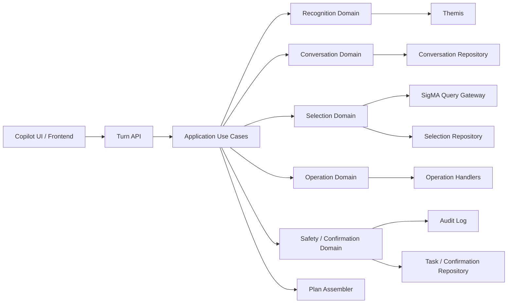
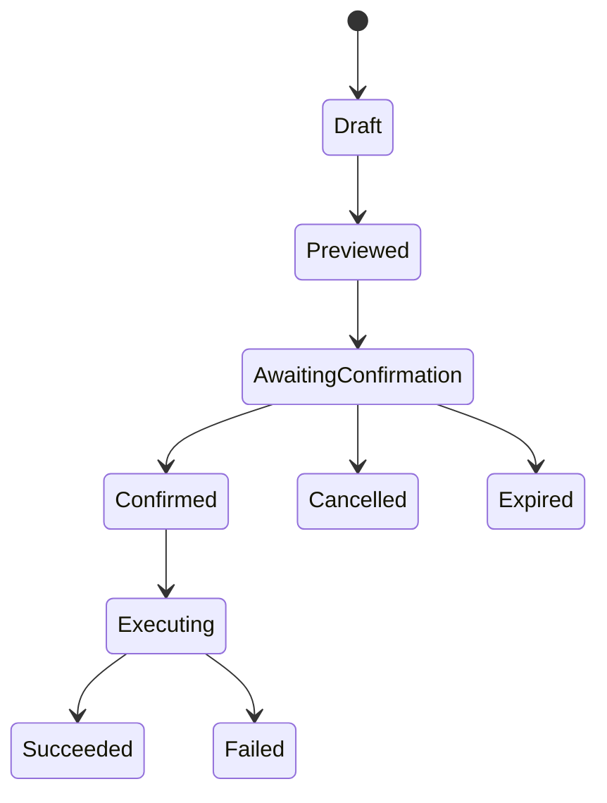
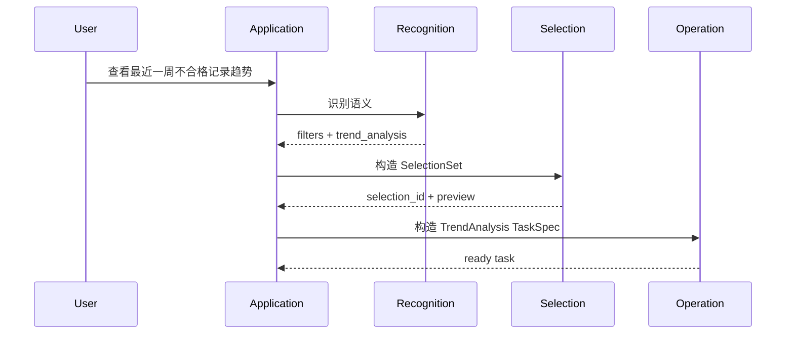
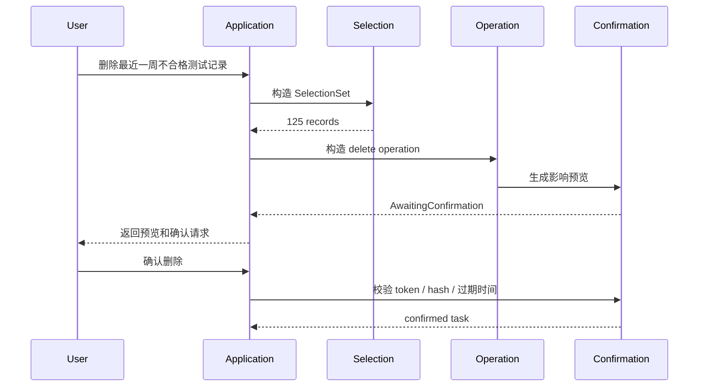
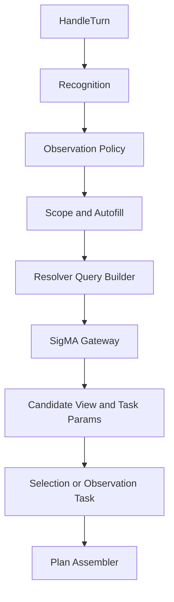
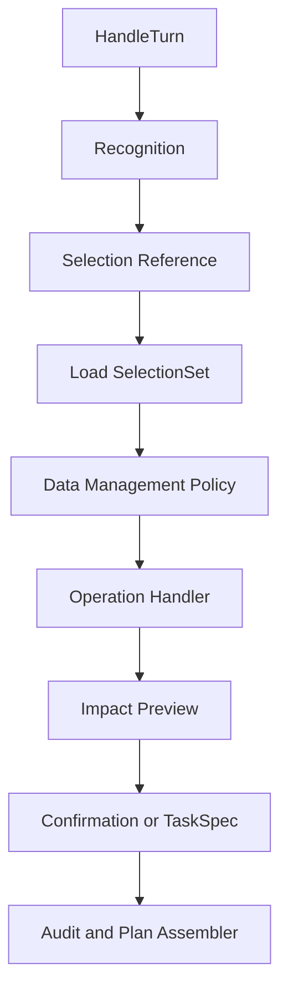
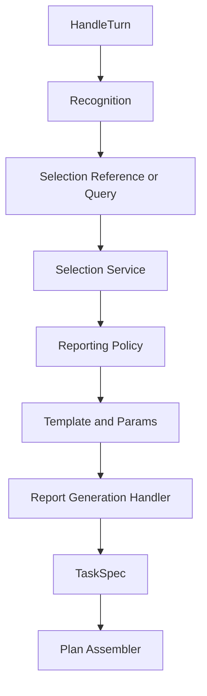
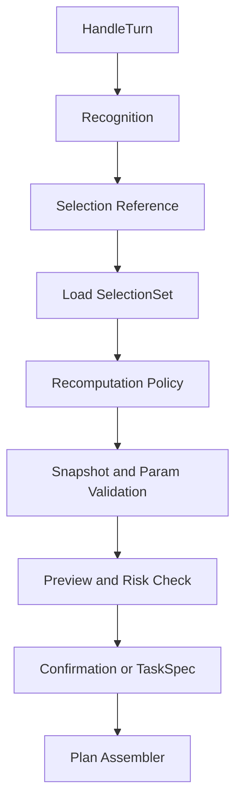

# SigMA Copilot 重构目标架构

## 1. 文档目的

本文档描述 SigMA Copilot 在完成完整重构后应收敛到的目标架构，用于指导后续分阶段治理，而不是建议一次性推倒重写。

本文档覆盖以下问题：

- 当前系统为什么难以继续承接新需求
- 完整重构后的职责划分应该是什么
- 新需求中的 `SelectionSet`、高危确认、任务状态、审计应该放在哪里
- API、应用层、领域层、集成层之间的边界应该如何约束
- 如何从当前实现平滑迁移到目标架构

## 2. 设计输入

目标架构需要同时满足以下约束：

- 继续使用 Themis 作为意图识别能力
- 业务代码只能依赖 Themis 公开 API，不直接依赖 `intent_fusion`
- 应用层自行构建执行计划，不把执行计划职责下放到 Themis
- 保持当前批量观察能力稳定
- 承接新增数据运维类需求：
  - 测试记录查询
  - 数据导出 / 备份 / 删除
  - 趋势分析
  - 报告生成
  - 音频生成
  - 指标重计算
- 对高危操作提供影响预览、确认流程、幂等控制和审计

## 3. 当前架构的主要问题

当前实现已经具备管线化雏形，但还不是能够稳定承接新业务域的最终架构，核心问题集中在四点：

1. Themis 识别结果与应用执行模型之间缺少稳定的中间语义层。
2. 当前状态模型只够维护 `slot_state`、`pending_task`、`active_task`，不够表达 `SelectionSet`、待确认操作、任务实例和审计信息。
3. `TaskPlanBuilder` 已经承担路由、上下文继承、缺参澄清、候选查询等多类职责，继续扩展会重新演化成 God Code。
4. 风险控制目前只有 `risk_level` 和 `requires_confirmation` 字段，没有真正的确认状态机、影响预览、版本校验和幂等执行闭环。

因此，后续重构的重点不应是继续往现有 planner 中追加分支，而是把下面三个概念拆开并稳定下来：

- `SelectionSet`：对哪些记录
- `Operation`：对这些记录做什么
- `Workflow`：当前进行到哪一步

## 4. 目标架构总览

完整重构后的目标建议采用“模块化单体 + 清晰领域边界 + 持久化工作流”的形态，暂不建议拆微服务。



### 4.1 总体原则

- `Conductor` 只负责流程编排，不承载业务规则。
- `Recognition` 只负责把自然语言转换为稳定的内部语义对象。
- `Selection` 只负责记录筛选条件、结果集合和集合引用。
- `Operation` 只负责定义对集合执行的业务动作。
- `Safety` 只负责预览、确认、审计、幂等和权限校验。
- `Application` 只负责把多个领域对象串成一个回合流程。
- `Integration` 只负责外部系统协议转换，不表达业务规则。

## 5. 分层设计

### 5.1 API 层

职责：

- 接收 `POST /turns`
- 反序列化请求
- 调用应用用例
- 返回结构化 `plan`

不负责：

- 业务意图判断
- SelectionSet 构造
- 确认逻辑
- 直接访问 SigMA 业务接口

### 5.2 Application 层

Application 层是编排层，不是领域规则承载层。建议只保留少量明确的用例：

- `HandleTurn`
- `ConfirmOperation`
- `CancelOperation`
- `GetTaskStatus`

`HandleTurn` 做的事情应该是：

1. 加载会话上下文
2. 调用 Recognition
3. 解析用户是“筛选数据”“执行操作”还是“确认已有操作”
4. 必要时构造 SelectionSet
5. 必要时构造 OperationRequest
6. 调用 Safety 生成预览或确认任务
7. 组装前端所需的 `plan`

### 5.3 Recognition Domain

Recognition 领域只负责解释用户语义，不直接生成业务执行计划。

输入：

- 用户消息
- 候选值
- 当前会话引用上下文

输出：

```python
class RecognizedCommand:
    verdict: str
    slot_changes: tuple[SlotChange, ...]
    actions: tuple[ActionIntent, ...]
    references: tuple[ReferenceIntent, ...]
    diagnostics: dict[str, object]
```

关键约束：

- Themis 原始对象不能在业务层到处透传
- Recognition 产出必须是应用自己的语义模型
- “上面这些数据”“这 100 条数据”要识别为引用语义，而不是普通 slot

### 5.4 Conversation Domain

Conversation 领域负责多轮会话状态，而不是只保存 `pending_task_name`。

建议状态模型：

```python
class ConversationState:
    session_id: str
    version: int
    active_selection_id: str | None
    recent_selection_ids: tuple[str, ...]
    pending_operation_id: str | None
    pending_confirmation_id: str | None
    active_task_id: str | None
    slot_state: dict[str, object]
```

职责：

- 管理当前活跃筛选集
- 管理多轮指代引用
- 管理待确认操作
- 管理当前任务上下文

不负责：

- 直接查询记录
- 构造业务操作
- 生成 UI plan

### 5.5 Selection Domain

这是重构后最关键的新领域，负责把“筛选哪些记录”建模成稳定对象。

核心模型：

```python
class RecordQuery:
    expression: FilterExpression
    sort: tuple[SortRule, ...]
    limit: int | None


class SelectionSet:
    id: str
    query: RecordQuery
    backend_ref: str | None
    record_count: int
    snapshot_version: str
    content_hash: str
    created_at: datetime
    expires_at: datetime | None
```

关键点：

- `SelectionSet` 不是前端临时变量，而是后端持久化实体
- 所有导出、删除、趋势、报告、重算操作都应引用 `SelectionSet`
- “查找最近一周不合格记录”先得到 `SelectionSet`
- “删除上面这些数据”是在已有 `SelectionSet` 上再追加 `DataDeleteOperation`

### 5.6 FilterExpression

当前系统不能继续把复杂筛选逻辑压扁成无结构 slot 集合。目标架构中需要独立的条件表达式模型。

```python
AllOf(
    TimeBetween(start, end),
    ProductModelEquals("dm3048_0"),
    AnyOf(
        ResultEquals("NG"),
        IndicatorFailed("RMS"),
    ),
)
```

这样才能稳定支持：

- 最近一周
- 最近 100 条
- 型号过滤
- 编号模糊匹配
- 任意一个不合格
- 全部共同不合格
- 同一件多次测试

### 5.7 Operation Domain

Operation 领域负责定义“对集合做什么”，不再让 `TaskPlanBuilder` 直接兼容所有业务。

建议统一模型：

```python
class OperationRequest:
    operation_type: str
    selection_id: str | None
    params: OperationParams
```

每个业务操作由独立 handler 实现：

- `RecordSearchHandler`
- `DataExportHandler`
- `DataBackupHandler`
- `DataDeleteHandler`
- `TrendAnalysisHandler`
- `BatchObservationHandler`
- `ReportGenerationHandler`
- `AudioGenerationHandler`
- `RecomputeColormapHandler`

每个 handler 只负责本操作的三件事：

```python
class OperationHandler(Protocol):
    def validate(self, request: OperationRequest) -> ValidationResult: ...
    async def preview(self, request: OperationRequest) -> ImpactPreview: ...
    def build_task(self, request: OperationRequest) -> TaskSpec: ...
```

### 5.8 Safety / Confirmation Domain

`risk_level` 和 `requires_confirmation` 在当前模型里已经存在，但这只是字段，不是完整能力。

完整能力应包括：

- 风险分级策略
- 影响预览
- 确认令牌
- 任务过期
- 幂等执行
- 审计记录
- 二次校验

建议策略模型：

```python
class OperationPolicy:
    risk_level: str
    preview_required: bool
    confirmation_required: bool
    audit_required: bool
```

高危确认状态机：



确认流程必须绑定以下信息：

- `operation_id`
- `selection_id`
- `selection_hash`
- `snapshot_version`
- 用户身份
- 风险等级
- 影响预览摘要
- 幂等键
- 过期时间

如果用户确认时 `SelectionSet` 已变化，则必须重新预览，不能直接执行旧操作。

### 5.9 TaskSpec

TaskSpec 是真正可执行的任务描述，不应继续退化为无约束字典。

```python
class TaskSpec:
    id: str
    operation_type: str
    selection_id: str | None
    params: OperationParams
    risk_level: str
    needs_confirmation: bool
    preview: ImpactPreview | None
    confirmation_token: str | None
    idempotency_key: str
```

`OperationParams` 应为判别联合，而不是裸 `dict[str, Any]`。

## 6. 端到端流程

### 6.1 低风险查询 / 观察



### 6.2 高危删除 / 重算



## 7. 推荐目录结构

下面的目录结构是**目标职责边界**，不是要求一次性把当前仓库全部重命名或搬迁到位。  
迁移时应优先采用“小步抽取 + 兼容旧入口”的方式：先把新职责放进目标位置，再逐步收缩旧模块。

```text
src/synapse/
  api/
    main.py                    # HTTP/FastAPI 入口
    turns.py                   # /turns 路由
    schemas.py                 # API 请求/响应 Schema
    presenters.py              # 内部 plan -> API 输出模型
  application/
    handle_turn.py             # 单轮请求编排
    confirm_operation.py       # 确认高危操作
    cancel_operation.py        # 取消待确认操作
    get_task_status.py         # 查询任务状态
    dto.py                     # application 层输入/输出对象
    ports.py                   # application 依赖的抽象接口
  recognition/
    models.py                  # RecognizedCommand 等中间语义模型
    service.py                 # 对 BusinessIntentRecognizer 的应用层封装
    mappers.py                 # Themis 结果 -> 内部语义模型
    references.py              # “上面这些数据”等引用语义解释
    preprocessing/
      pipeline.py              # 识别前预处理总流程
      arbiter.py               # 多预处理策略裁决
      contracts.py             # 预处理协议
  conversation/
    models.py                  # ConversationState
    service.py                 # 会话状态读写与变更规则
    repository.py              # 会话仓储抽象
    projection.py              # slot_state / active task 投影
  selection/
    models.py                  # RecordQuery / SelectionSet / FilterExpression
    filters.py                 # 条件表达式构造与规范化
    service.py                 # 创建、刷新、读取 SelectionSet
    repository.py              # SelectionSet 仓储抽象
    references.py              # 多轮“这批/上面/最近那次”引用解析
    candidate_views.py         # 面向前端的选择结果展示模型
  operations/
    models.py                  # OperationRequest / TaskSpec / OperationParams
    contracts.py               # OperationHandler 协议
    registry.py                # 操作类型到 handler 的注册表
    handlers/
      record_search.py         # 查询/观察类操作
      trend_analysis.py        # 趋势分析
      data_export.py           # 导出
      data_backup.py           # 备份
      data_delete.py           # 删除
      report_generation.py     # 报告生成
      audio_generation.py      # 音频生成
      recompute_colormap.py    # 指标重计算
  confirmation/
    models.py                  # Confirmation / Preview / Policy
    service.py                 # 预览、确认、过期、幂等校验
    repository.py              # 待确认任务仓储抽象
    preview.py                 # 影响预览组装
    tokens.py                  # confirmation token / idempotency key
  domains/
    observation/
      policy.py                # 观测域规则
      slots.py                 # 域内 slot 语义
      autofill.py              # 域内自动补全
      scope.py                 # 观测范围规则
      task_params.py           # 观测相关操作参数映射
      resolver_query.py        # 域内 resolver 查询构造
      resolver_query_view.py   # 域内候选展示
      catalog.py               # 域内目录/别名/枚举
    data_management/
      policy.py                # 导出/备份/删除等规则
      task_params.py           # 数据管理参数映射
      preview.py               # 数据管理类影响预览
    reporting/
      policy.py                # 报告域规则
      task_params.py           # 报告参数映射
      templates.py             # 报告模板选择策略
    recomputation/
      policy.py                # 重计算规则
      task_params.py           # 重计算参数映射
  integrations/
    sigma/
      gateway.py               # 对上层暴露的统一网关
      contracts.py             # 外部数据契约
      http.py                  # HTTP 访问实现
      snapshot.py              # 快照加载/缓存
      mappers.py               # 外部响应 -> 内部对象
  infrastructure/
    persistence/
      conversation_repo.py     # 会话仓储实现
      selection_repo.py        # SelectionSet 仓储实现
      confirmation_repo.py     # 确认任务仓储实现
      task_repo.py             # 任务状态仓储实现
    audit/
      writer.py                # 审计写入
      models.py                # 审计记录模型
    clock.py                   # 时间提供者
    ids.py                     # ID / token 生成
    logging.py                 # 日志适配
```

目录规则：

- `api/` 只处理协议边界，不做业务判断；不能在这里拼装 SelectionSet、直接查 SigMA、或写确认状态机。
- `application/` 只做流程编排；它可以依赖多个领域，但不应该承载业务域常量、候选展示细节或高危策略细节。
- `recognition/` 负责把 Themis 决策转成应用自有语义对象；不能直接泄漏 Themis 原始对象到别层。
- `conversation/` 负责会话生命周期、active selection / pending confirmation / active task 等状态；不直接做业务操作参数拼装。
- `selection/` 负责“选中了哪些记录”；这里放通用查询模型、引用模型、筛选表达式，不放删除/导出/报告等具体动作规则。
- `operations/` 负责“对这批记录做什么”；每个操作类型一个 handler，避免继续向单个 planner 追加分支。
- `confirmation/` 负责高危预览、确认、过期、幂等和二次校验；不负责识别用户意图，也不直接拼前端 plan。
- `domains/` 放业务域特有规则。这里可以有观测域、数据管理域、报告域、重计算域，但不应出现通用编排逻辑。
- `integrations/sigma/` 只做外部系统协议适配、HTTP、快照、DTO 映射；不放业务判断，不放会话状态。
- `infrastructure/` 放仓储、审计、时钟、ID、日志等技术实现；这里是实现细节，不承载业务语义。

### 7.1 推荐的层内分工

- `api/`
  - 输入：HTTP 请求、反序列化后的 API Schema。
  - 输出：稳定的 `TurnPlan` 或错误响应。
  - 典型内容：路由、Schema、Presenter、异常映射。
- `application/`
  - 输入：用例请求对象。
  - 输出：用例响应对象。
  - 典型内容：`HandleTurn`、`ConfirmOperation`、`CancelOperation`、`GetTaskStatus`。
- `recognition/`
  - 输入：用户消息、候选项、会话引用上下文。
  - 输出：`RecognizedCommand`、`ActionIntent`、`ReferenceIntent`。
  - 典型内容：Themis 适配、预处理、内部中间语义模型。
- `conversation/`
  - 输入：session id、当前状态、状态更新请求。
  - 输出：新状态、状态投影。
  - 典型内容：`ConversationState`、状态仓储、状态演进规则。
- `selection/`
  - 输入：筛选条件、引用表达式、外部查询结果。
  - 输出：`SelectionSet`、候选展示、引用解析结果。
  - 典型内容：`FilterExpression`、`RecordQuery`、引用解析、集合持久化。
- `operations/`
  - 输入：`OperationRequest`。
  - 输出：校验结果、影响预览、`TaskSpec`。
  - 典型内容：handler、registry、统一操作契约。
- `confirmation/`
  - 输入：高危 `OperationRequest` 或待确认 token。
  - 输出：预览结果、待确认任务、确认结果。
  - 典型内容：确认状态机、token 校验、幂等键、过期策略。
- `domains/*`
  - 输入：领域内规则需要的参数和上下文。
  - 输出：领域决策、参数补全、候选展示、局部校验。
  - 典型内容：别名、目录、策略、autofill、domain-specific projector。

### 7.2 放置规则

- 新增“识别语义解释”代码，优先放 `recognition/`，不要继续塞进 `planning/` 或 `engine/`。
- 新增“会话状态字段、状态迁移、active selection/pending confirmation 管理”代码，放 `conversation/`。
- 新增“筛选条件表达、记录集合持久化、‘上面这些数据’引用”代码，放 `selection/`。
- 新增“导出、备份、删除、趋势、报告、重计算”等执行动作，放 `operations/handlers/`，并通过 `registry.py` 注册。
- 新增“高危确认、影响预览、二次校验、幂等键”代码，放 `confirmation/`。
- 新增业务域常量、别名、特殊补全逻辑、域内 candidate view，放对应 `domains/<domain>/`。
- 新增 SigMA 接口适配、HTTP DTO、快照转换，放 `integrations/sigma/`。
- 新增仓储实现、审计写入、时钟/ID 等技术细节，放 `infrastructure/`。

### 7.3 明确不建议出现的目录做法

- 不建议新增 `utils.py`、`helpers.py`、`common.py` 这类无限增长的兜底文件。
- 不建议在 `application/` 或 `engine/` 中放具体业务域常量，例如观测指标、频谱、工况别名等。
- 不建议在 `integrations/` 中直接构造应用层 `TaskSpec` 或前端 `TurnPlan`。
- 不建议在 `selection/` 中放删除/导出/报告的执行策略。
- 不建议在 `operations/` 中直接操作会话状态仓储。
- 不建议在 `api/schemas.py` 中承载业务规则或默认补全逻辑。

### 7.4 与当前仓库的大致映射

这不是要求立即重命名，而是给后续小步迁移一个明确方向：

- 当前 `engine/conductor.py` 的编排职责，目标上应收敛到 `application/handle_turn.py`。
- 当前 `planning/planner.py`、`planning/tasks.py` 中混合的“查询 + 操作 + 确认”逻辑，目标上应拆到 `selection/`、`operations/`、`confirmation/`。
- 当前 `session/task_context.py` 的状态职责，目标上应归入 `conversation/`。
- 当前 `slots/` 中与“筛选条件”“引用集合”“slot state 投影”相关的内容，目标上分别下沉到 `selection/` 与 `conversation/`。
- 当前 `domains/observation/` 中的业务域知识仍然保留在 domain 层，但应逐步减少对编排层的大量反向渗透。
- 当前 `integrations/sigma/` 已经接近目标方向，应继续保持“协议适配，不承载业务规则”的边界。

### 7.5 落地时的顺序建议

- 先新增目标目录下的私有 helper 或 service，不立即删除旧模块。
- 先在旧入口调用新模块，确认行为等价后，再缩减旧实现。
- 每次只迁移一类职责，例如“先迁移 selection 引用解析”，不要一次同时迁移 recognition、selection、operations。
- 迁移前优先补 characterization tests，记录当前外部行为。
- 如果一个改动会同时影响目录迁移、业务行为和 API 输出，应拆成多个 PR。

### 7.6 各 Domain 流程编排示意

下面的图是**目标职责编排示意**，重点是说明每个 domain 在整条链路中的位置，不代表必须严格按同名文件一一落地。

#### Observation Domain

观测域负责把“看什么、按什么范围看、候选如何展示、参数如何补全”组织成稳定规则。



#### Data Management Domain

数据管理域负责把“导出、备份、删除”这类动作约束在已有 `SelectionSet` 之上，并接入风险控制。



#### Reporting Domain

报告域负责基于选定数据集和报告类型拼装参数、模板和生成任务，而不是自己维护会话状态。



#### Recomputation Domain

重计算域负责定义可重算对象、前置校验、影响评估和重算参数，不直接承载确认状态机。



## 8. API 输出模型

目标架构中，API 边界不应把内部计划退化成普通字典，建议使用判别联合：

```python
TurnPlan = (
    ReplyPlan
    | ClarifyPlan
    | SelectionPlan
    | TaskPlan
    | ConfirmationPlan
)
```

其中至少要稳定支持：

- `reply`
- `clarify`
- `selection`
- `task`
- `confirmation`
- `task_status`

## 9. 渐进迁移路径

不建议一次性重写，建议按以下顺序拆分：

1. 先抽出 Recognition 中间语义模型，隔离 Themis 原始对象。
2. 引入 `ConversationState` 持久化仓储，替换当前纯内存 `pending_task / active_task`。
3. 新增 `Selection Domain`，先承接记录查询和“上面这些数据”引用。
4. 把观察、趋势、导出等能力迁移到 `OperationHandler`。
5. 引入 `Confirmation Domain`，闭环高危预览、确认、幂等和审计。
6. 最后收缩旧的 `TaskPlanBuilder`，让它只保留兼容层职责。

## 10. 非目标

本次目标架构不建议同时做以下事情：

- 直接拆微服务
- 重写 Themis 接入方式
- 修改公开 YAML 语义格式
- 在一次改造中同时替换前端协议和后端存储
- 把所有业务域抽象成统一元框架

## 11. 成功标准

重构完成后，系统应满足以下判断标准：

- 新增一个操作类型时，不需要改动主编排流程中的大段 `if/else`
- “查询数据”和“对数据执行操作”在模型上明确分离
- 高危操作必须经过预览、确认、版本校验和审计
- 多轮引用依赖 `SelectionSet`，而不是依赖模糊上下文猜测
- 业务规则主要落在 domain 和 handler，不继续堆积在 orchestrator / planner 中
- API 输出类型稳定，前端无需依赖隐式字典字段

## 12. 结论

完整重构后的核心不是“换一套新框架”，而是把当前系统从“意图 + slot + 临时 task”收敛为三个稳定实体：

- `SelectionSet`
- `Operation`
- `Workflow`

只要这三个模型稳定下来，后续新增测试记录查询、趋势分析、导出、备份、删除、报告生成、音频生成和指标重计算，都可以按独立 handler 和独立策略接入，而不需要再次把复杂度堆回单个 planner 或 runtime。
