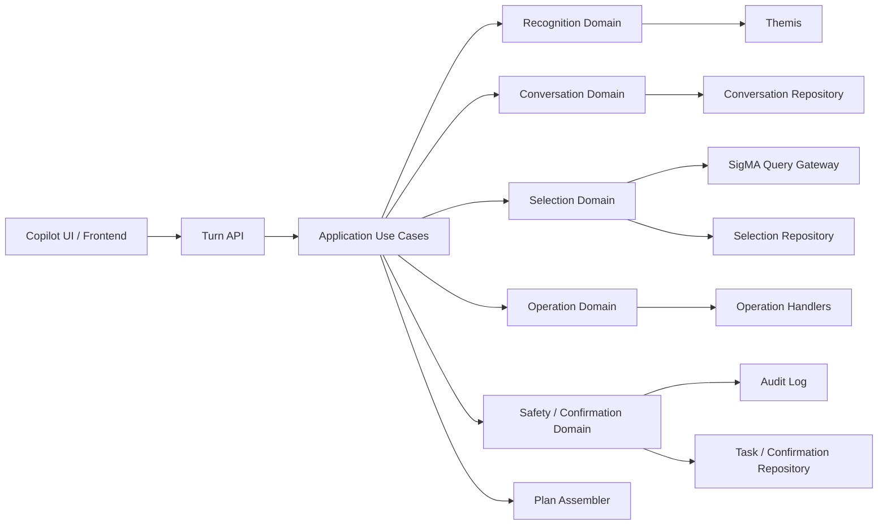
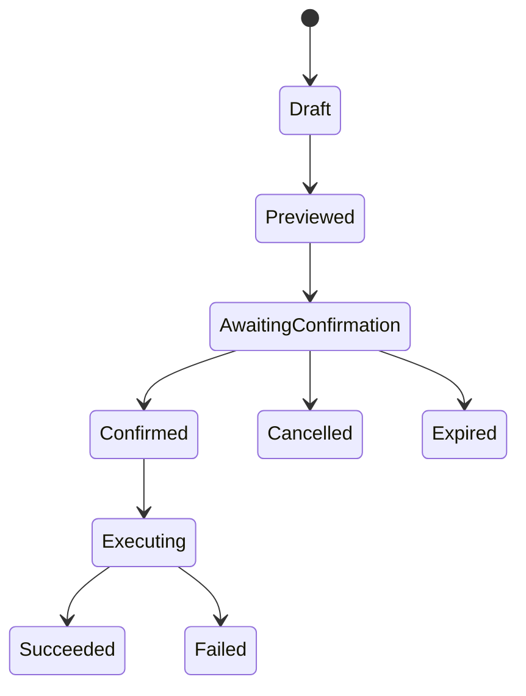
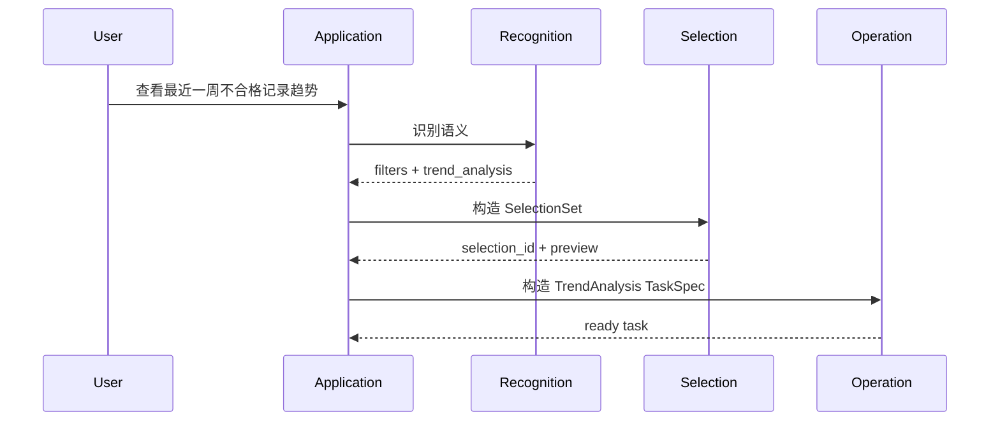
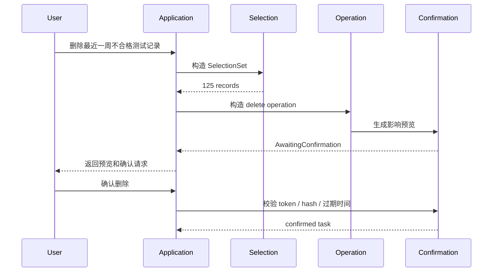

# SigMA Copilot 重构目标架构

## 1. 文档目的

本文档描述 SigMA Copilot 在完成完整重构后应收敛到的目标架构，用于指导后续分阶段治理，而不是建议一次性推倒重写。

本文档覆盖以下问题：

- 当前系统为什么难以继续承接新需求
- 完整重构后的职责划分应该是什么
- 新需求中的 `SelectionSet`、高危确认、任务状态、审计应该放在哪里
- API、应用层、领域层、集成层之间的边界应该如何约束
- 如何从当前实现平滑迁移到目标架构

## 2. 设计输入

目标架构需要同时满足以下约束：

- 继续使用 Themis 作为意图识别能力
- 业务代码只能依赖 Themis 公开 API，不直接依赖 `intent_fusion`
- 应用层自行构建执行计划，不把执行计划职责下放到 Themis
- 保持当前批量观察能力稳定
- 承接新增数据运维类需求：
  - 测试记录查询
  - 数据导出 / 备份 / 删除
  - 趋势分析
  - 报告生成
  - 音频生成
  - 指标重计算
- 对高危操作提供影响预览、确认流程、幂等控制和审计

## 3. 当前架构的主要问题

当前实现已经具备管线化雏形，但还不是能够稳定承接新业务域的最终架构，核心问题集中在四点：

1. Themis 识别结果与应用执行模型之间缺少稳定的中间语义层。
2. 当前状态模型只够维护 `slot_state`、`pending_task`、`active_task`，不够表达 `SelectionSet`、待确认操作、任务实例和审计信息。
3. `TaskPlanBuilder` 已经承担路由、上下文继承、缺参澄清、候选查询等多类职责，继续扩展会重新演化成 God Code。
4. 风险控制目前只有 `risk_level` 和 `requires_confirmation` 字段，没有真正的确认状态机、影响预览、版本校验和幂等执行闭环。

因此，后续重构的重点不应是继续往现有 planner 中追加分支，而是把下面三个概念拆开并稳定下来：

- `SelectionSet`：对哪些记录
- `Operation`：对这些记录做什么
- `Workflow`：当前进行到哪一步

## 4. 目标架构总览

完整重构后的目标建议采用“模块化单体 + 清晰领域边界 + 持久化工作流”的形态，暂不建议拆微服务。



### 4.1 总体原则

- `Conductor` 只负责流程编排，不承载业务规则。
- `Recognition` 只负责把自然语言转换为稳定的内部语义对象。
- `Selection` 只负责记录筛选条件、结果集合和集合引用。
- `Operation` 只负责定义对集合执行的业务动作。
- `Safety` 只负责预览、确认、审计、幂等和权限校验。
- `Application` 只负责把多个领域对象串成一个回合流程。
- `Integration` 只负责外部系统协议转换，不表达业务规则。

## 5. 分层设计

### 5.1 API 层

职责：

- 接收 `POST /turns`
- 反序列化请求
- 调用应用用例
- 返回结构化 `plan`

不负责：

- 业务意图判断
- SelectionSet 构造
- 确认逻辑
- 直接访问 SigMA 业务接口

### 5.2 Application 层

Application 层是编排层，不是领域规则承载层。建议只保留少量明确的用例：

- `HandleTurn`
- `ConfirmOperation`
- `CancelOperation`
- `GetTaskStatus`

`HandleTurn` 做的事情应该是：

1. 加载会话上下文
2. 调用 Recognition
3. 解析用户是“筛选数据”“执行操作”还是“确认已有操作”
4. 必要时构造 SelectionSet
5. 必要时构造 OperationRequest
6. 调用 Safety 生成预览或确认任务
7. 组装前端所需的 `plan`

### 5.3 Recognition Domain

Recognition 领域只负责解释用户语义，不直接生成业务执行计划。

输入：

- 用户消息
- 候选值
- 当前会话引用上下文

输出：

```python
class RecognizedCommand:
    verdict: str
    slot_changes: tuple[SlotChange, ...]
    actions: tuple[ActionIntent, ...]
    references: tuple[ReferenceIntent, ...]
    diagnostics: dict[str, object]
```

关键约束：

- Themis 原始对象不能在业务层到处透传
- Recognition 产出必须是应用自己的语义模型
- “上面这些数据”“这 100 条数据”要识别为引用语义，而不是普通 slot

### 5.4 Conversation Domain

Conversation 领域负责多轮会话状态，而不是只保存 `pending_task_name`。

建议状态模型：

```python
class ConversationState:
    session_id: str
    version: int
    active_selection_id: str | None
    recent_selection_ids: tuple[str, ...]
    pending_operation_id: str | None
    pending_confirmation_id: str | None
    active_task_id: str | None
    slot_state: dict[str, object]
```

职责：

- 管理当前活跃筛选集
- 管理多轮指代引用
- 管理待确认操作
- 管理当前任务上下文

不负责：

- 直接查询记录
- 构造业务操作
- 生成 UI plan

### 5.5 Selection Domain

这是重构后最关键的新领域，负责把“筛选哪些记录”建模成稳定对象。

核心模型：

```python
class RecordQuery:
    expression: FilterExpression
    sort: tuple[SortRule, ...]
    limit: int | None


class SelectionSet:
    id: str
    query: RecordQuery
    backend_ref: str | None
    record_count: int
    snapshot_version: str
    content_hash: str
    created_at: datetime
    expires_at: datetime | None
```

关键点：

- `SelectionSet` 不是前端临时变量，而是后端持久化实体
- 所有导出、删除、趋势、报告、重算操作都应引用 `SelectionSet`
- “查找最近一周不合格记录”先得到 `SelectionSet`
- “删除上面这些数据”是在已有 `SelectionSet` 上再追加 `DataDeleteOperation`

### 5.6 FilterExpression

当前系统不能继续把复杂筛选逻辑压扁成无结构 slot 集合。目标架构中需要独立的条件表达式模型。

```python
AllOf(
    TimeBetween(start, end),
    ProductModelEquals("dm3048_0"),
    AnyOf(
        ResultEquals("NG"),
        IndicatorFailed("RMS"),
    ),
)
```

这样才能稳定支持：

- 最近一周
- 最近 100 条
- 型号过滤
- 编号模糊匹配
- 任意一个不合格
- 全部共同不合格
- 同一件多次测试

### 5.7 Operation Domain

Operation 领域负责定义“对集合做什么”，不再让 `TaskPlanBuilder` 直接兼容所有业务。

建议统一模型：

```python
class OperationRequest:
    operation_type: str
    selection_id: str | None
    params: OperationParams
```

每个业务操作由独立 handler 实现：

- `RecordSearchHandler`
- `DataExportHandler`
- `DataBackupHandler`
- `DataDeleteHandler`
- `TrendAnalysisHandler`
- `BatchObservationHandler`
- `ReportGenerationHandler`
- `AudioGenerationHandler`
- `RecomputeColormapHandler`

每个 handler 只负责本操作的三件事：

```python
class OperationHandler(Protocol):
    def validate(self, request: OperationRequest) -> ValidationResult: ...
    async def preview(self, request: OperationRequest) -> ImpactPreview: ...
    def build_task(self, request: OperationRequest) -> TaskSpec: ...
```

### 5.8 Safety / Confirmation Domain

`risk_level` 和 `requires_confirmation` 在当前模型里已经存在，但这只是字段，不是完整能力。

完整能力应包括：

- 风险分级策略
- 影响预览
- 确认令牌
- 任务过期
- 幂等执行
- 审计记录
- 二次校验

建议策略模型：

```python
class OperationPolicy:
    risk_level: str
    preview_required: bool
    confirmation_required: bool
    audit_required: bool
```

高危确认状态机：



确认流程必须绑定以下信息：

- `operation_id`
- `selection_id`
- `selection_hash`
- `snapshot_version`
- 用户身份
- 风险等级
- 影响预览摘要
- 幂等键
- 过期时间

如果用户确认时 `SelectionSet` 已变化，则必须重新预览，不能直接执行旧操作。

### 5.9 TaskSpec

TaskSpec 是真正可执行的任务描述，不应继续退化为无约束字典。

```python
class TaskSpec:
    id: str
    operation_type: str
    selection_id: str | None
    params: OperationParams
    risk_level: str
    needs_confirmation: bool
    preview: ImpactPreview | None
    confirmation_token: str | None
    idempotency_key: str
```

`OperationParams` 应为判别联合，而不是裸 `dict[str, Any]`。

## 6. 端到端流程

### 6.1 低风险查询 / 观察



### 6.2 高危删除 / 重算



## 7. 推荐目录结构

```text
src/synapse/
  api/
  application/
  recognition/
  conversation/
  selection/
  operations/
  confirmation/
  domains/
    observation/
    data_management/
    reporting/
    recomputation/
  integrations/
    sigma/
  infrastructure/
    persistence/
    audit/
```

目录规则：

- `domains/` 放业务域特有规则
- `selection/` 放通用记录集合模型，不放具体业务操作
- `operations/` 放操作定义和 handler，不放对话状态
- `integrations/sigma/` 只做外部系统协议适配
- `infrastructure/` 放仓储、数据库、审计、时钟等技术实现

## 8. API 输出模型

目标架构中，API 边界不应把内部计划退化成普通字典，建议使用判别联合：

```python
TurnPlan = (
    ReplyPlan
    | ClarifyPlan
    | SelectionPlan
    | TaskPlan
    | ConfirmationPlan
)
```

其中至少要稳定支持：

- `reply`
- `clarify`
- `selection`
- `task`
- `confirmation`
- `task_status`

## 9. 渐进迁移路径

不建议一次性重写，建议按以下顺序拆分：

1. 先抽出 Recognition 中间语义模型，隔离 Themis 原始对象。
2. 引入 `ConversationState` 持久化仓储，替换当前纯内存 `pending_task / active_task`。
3. 新增 `Selection Domain`，先承接记录查询和“上面这些数据”引用。
4. 把观察、趋势、导出等能力迁移到 `OperationHandler`。
5. 引入 `Confirmation Domain`，闭环高危预览、确认、幂等和审计。
6. 最后收缩旧的 `TaskPlanBuilder`，让它只保留兼容层职责。

## 10. 非目标

本次目标架构不建议同时做以下事情：

- 直接拆微服务
- 重写 Themis 接入方式
- 修改公开 YAML 语义格式
- 在一次改造中同时替换前端协议和后端存储
- 把所有业务域抽象成统一元框架

## 11. 成功标准

重构完成后，系统应满足以下判断标准：

- 新增一个操作类型时，不需要改动主编排流程中的大段 `if/else`
- “查询数据”和“对数据执行操作”在模型上明确分离
- 高危操作必须经过预览、确认、版本校验和审计
- 多轮引用依赖 `SelectionSet`，而不是依赖模糊上下文猜测
- 业务规则主要落在 domain 和 handler，不继续堆积在 orchestrator / planner 中
- API 输出类型稳定，前端无需依赖隐式字典字段

## 12. 结论

完整重构后的核心不是“换一套新框架”，而是把当前系统从“意图 + slot + 临时 task”收敛为三个稳定实体：

- `SelectionSet`
- `Operation`
- `Workflow`

只要这三个模型稳定下来，后续新增测试记录查询、趋势分析、导出、备份、删除、报告生成、音频生成和指标重计算，都可以按独立 handler 和独立策略接入，而不需要再次把复杂度堆回单个 planner 或 runtime。
