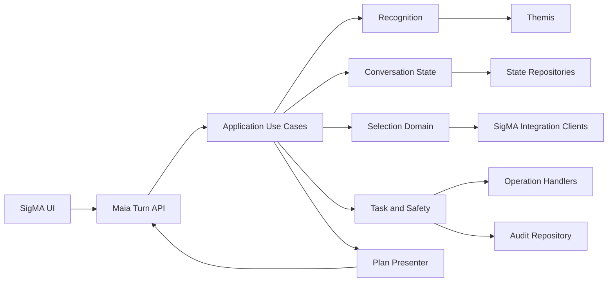
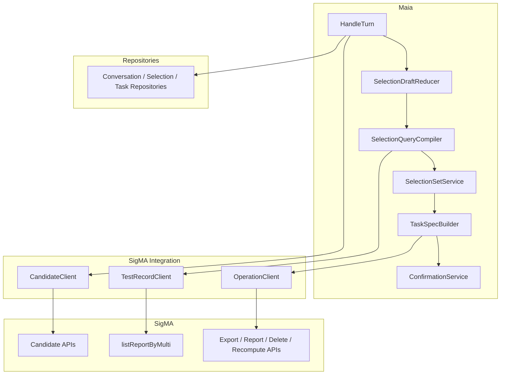
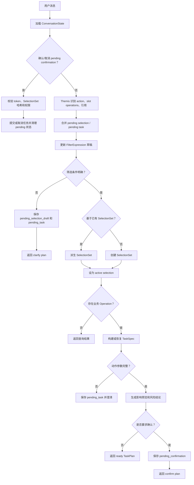
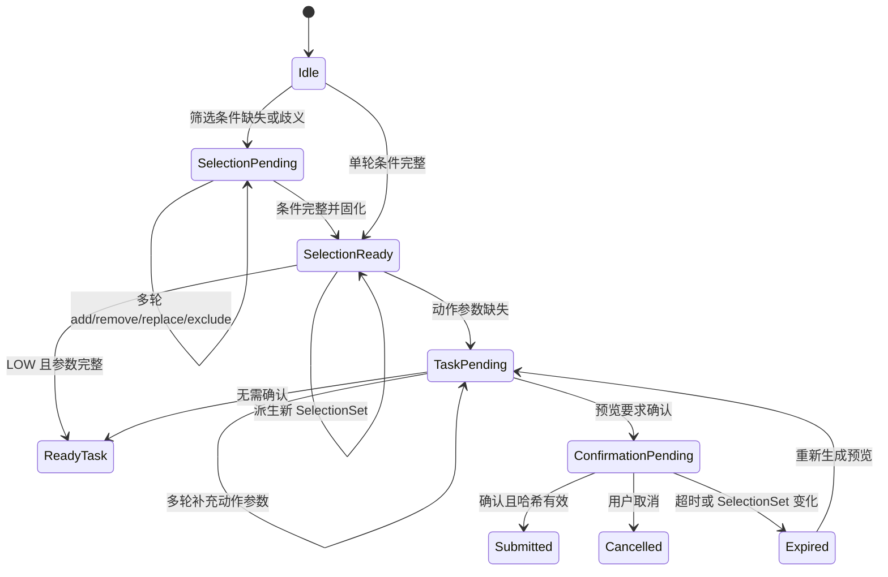
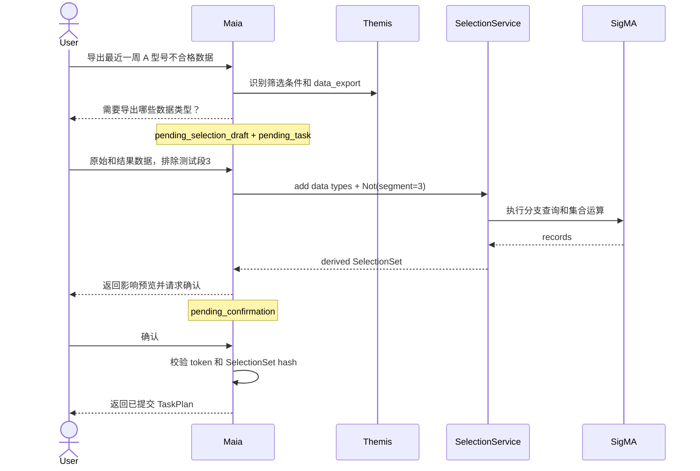

# SigMA Copilot 数据运维能力最终实施计划

本文件是新实现的执行基线；与其他历史重构文档冲突时，以本文件为准。

## 1. 已确认决策

1. 新实现统一放入 `src/maia`。
2. `src/synapse` 冻结为遗留实现：不修改、不扩展，新代码不得导入它。
3. 继续使用 Themis 公开 API 做意图识别，应用层自行构建计划。
4. 保持前端 `/turns` Response JSON 契约兼容，不复用旧内部实现。
5. 核心链路为：
   `SelectionDraft -> FilterExpression -> SelectionSet -> TaskSpec`。
6. SelectionSet 不可变；修改筛选条件会派生新的 SelectionSet，并保留 lineage。
7. 初版通过防腐层复用 `listReportByMulti`，后续只替换 SigMA client。
8. 每个 Codex Goal 的非测试代码目标为 220–260 行，260 行为硬上限。
9. 第一里程碑优先交付“自然语言 -> Themis 识别信息”的独立 CLI，
   不等待 SelectionSet、SigMA 查询或 `/turns` 完成。

## 2. 核心领域模型

### 2.1 FilterExpression

组合筛选使用条件树，不使用扁平且语义不明确的参数字典：

```text
FilterExpression = AllOf | AnyOf | Not | Predicate
```

`Predicate` 覆盖产品型号、配置序号、检测系统、编号匹配、时间、综合结果、
传感器、测试段、指标、人工标记、归档、重复测试和数据制品可用性。
`SelectionQuery` 由 `expression + sort + limit` 构成，“最近 N 条”由确定排序
和 `limit` 表达。

示例：

```text
AllOf(
  ProductTypeIn(["dm0608_3"]),
  TestedAtBetween(start, end),
  AnyOf(
    SummaryResultIn(["FAIL"]),
    IndicatorFailed(sensor="Vib1", segment="测试段3", indicator="RMS"),
  ),
)
```

规则：

- `AllOf` 表示交集，`AnyOf` 表示并集，`Not` 表示差集。
- 同一维度多个值默认是 `IN`，跨维度默认是 `AND`。
- “任意一个不合格”和“全部共同不合格”必须显式映射为 `AnyOf`/`AllOf`。
- 旧接口不能直接表达关联条件时，将条件树拆成多个单条件查询，再按记录 ID
  执行交、并、差；禁止弱化条件或静默返回近似结果。

### 2.2 SelectionDraft

多轮对话先更新草稿，不直接修改已固化集合：

```text
SelectionDraft:
  base_selection_id
  expression
  sort
  limit
  pending_questions
  revision
```

支持的草稿操作：

- `add`：增加筛选条件。
- `remove`：移除指定条件或值。
- `replace`：替换某个维度。
- `exclude`：追加 `Not(...)`。
- `clear`：清空筛选条件。
- `limit`：最近 N 条。

“再加 A 型号”“不要测试段 3”“时间改成最近一月”等输入都通过 reducer
生成新 revision。存在歧义或缺少必要范围时保存 `pending_selection_draft` 并澄清。

### 2.3 SelectionSet 与派生

SelectionSet 包含 ID、规范化条件树、记录数、记录 ID 或后端快照引用、内容哈希、
源版本、创建时间、过期时间、父 SelectionSet ID 和派生操作。

派生类型：

- `create`：从空上下文首次查询。
- `refine`：增加约束，结果通常是父集合子集。
- `expand`：增加 OR 分支，扩大集合。
- `exclude`：从父集合排除记录。
- `replace`：替换筛选维度后重新查询。
- `limit`：在确定排序后取最近 N 条。

所有 TaskSpec 固定引用具体 SelectionSet ID 和哈希。后续派生不会改变已创建任务。

### 2.4 Pending 状态

```text
ConversationState:
  active_selection_set_id
  recent_selection_set_ids
  pending_selection_draft
  pending_task
  pending_confirmation
  active_task_id
  version
```

- `pending_selection_draft`：筛选条件尚需补全或澄清。
- `pending_task`：业务动作已识别，但 SelectionSet 或动作参数未就绪。
- `pending_confirmation`：影响预览已生成，等待确认、取消或过期。
- 修改 SelectionSet 会使依赖旧哈希的 confirmation 失效并要求重新预览。

## 3. 目标架构

### 3.1 代码边界

```text
src/maia/
  api/                  # /turns 入口和 Response 契约
  application/          # HandleTurn、ConfirmTask 等用例
  recognition/          # Themis adapter
  conversation/         # draft、引用和 pending 状态
  selection/            # 表达式、SelectionSet、查询编译和仓储
  tasks/                # TaskSpec、风险、预览和确认
  operations/           # 独立业务动作
  integrations/sigma/   # SigMA clients、contracts 和 HTTP 映射
  presentation/         # 内部结果到前端 plan
  cli.py                # NL -> recognition 调试入口

configs/maia/
  recognition.yaml
  intents/
  calibration_cases.yaml
  resolver_values.example.yaml
```

这里不使用 `ports` 作为包名或组件名。`Port` 只是一种架构概念，代码使用更直接的：

- `TestRecordClient`：测试记录查询。
- `CandidateClient`：产品、系统、传感器、测试段和指标候选。
- `OperationClient`：导出、报告、备份、删除和重计算任务。
- `Repositories`：会话、SelectionSet、Task 和审计状态存储。

### 3.2 逻辑架构



### 3.3 组件图



### 3.4 核心处理流程



### 3.5 状态机



### 3.6 多轮组合筛选与确认交互



### 3.7 意图识别 CLI

第一阶段提供独立入口，不经过 `/turns`、SelectionSet 或 SigMA 查询：

```text
NL input
  -> load Maia recognition config and intent YAML
  -> BusinessIntentRecognizer
  -> normalize public Themis decision
  -> human or JSON output
```

命令：

```powershell
uv run maia recognize --message "导出最近一周 A 型号的不合格数据"
uv run maia recognize --message "删除上面这些数据" --json --diagnostics
uv run maia recognize
```

未提供 `--message` 时进入逐行交互模式。CLI 由 `src/maia/cli.py` 提供，
`pyproject.toml` 注册 `maia = "maia.cli:main"`，不新增 CLI 框架依赖。

`--json` 模式的稳定输出模型：

```json
{
  "message": "删除上面这些数据",
  "verdict": "clear",
  "requires_confirmation": false,
  "degraded": false,
  "intents": [
    {"name": "task.nvh.data_delete", "score": 0.98, "slots": {}}
  ],
  "action_intents": [
    {"name": "task.nvh.data_delete", "score": 0.98}
  ],
  "slot_operations": [],
  "diagnostics": {}
}
```

默认 CLI 展示面向人工调试，不直接打印 JSON：

```text
Input
  查找最近一周不合格记录

Decision
  Verdict                 clear
  Requires confirmation   no
  Degraded                no

Action Intents
  1. task.nvh.record_search                         score=0.9821

Slot Operations
  1. summary_result
     action     replace
     target     fail
     valid      yes
  2. time_range
     action     replace
     target     最近一周
     valid      yes

Diagnostics
  hidden (use --diagnostics)
```

展示规则：

- `requires_confirmation` 在这里是 Themis 的歧义确认标志，不是业务删除确认。
- 业务风险等级和删除确认由后续 RiskPolicy 计算，CLI 不推测。
- 默认按 `Input / Decision / Intents / Slot Operations / Diagnostics` 分区展示。
- 列表使用编号，slot 的 action、target 和 valid 分行对齐。
- 空列表明确显示 `(none)`，不能直接省略整个分区。
- `--json` 才输出机器可读 JSON；JSON 使用 2 空格缩进且中文不转义。
- 可选 `--compact` 仅与 `--json` 同时使用，输出单行 JSON。
- `--diagnostics` 才输出诊断字段，默认不输出 prompt、Token 或密钥。
- `--resolver-values <yaml>` 可注入本地候选值，便于验证 slot 和 `slot_valid`。
- CLI 输出只依赖 Themis 公开字段：`verdict`、`intents`、`slot_operations`、
  `action_intents`、`requires_confirmation`、`degraded`、`diagnostics`。
- 单条模式 stdout 只包含结果视图；日志和错误写入 stderr。
- 交互模式每次结果之间打印固定分隔线，然后重新显示输入提示。

首批识别范围同时包含终止动作和筛选条件操作：

| 类型 | 初始范围 |
| --- | --- |
| 终止动作 | record search、export、backup、delete、trend、batch observation、report download/generation、audio generation、colormap recompute |
| 筛选条件 | time、product type、config version、system、serial number、result、sensor、test segment、indicator、manual tagging、archive、artifact availability、repeat serial、latest N、filter operator |
| 上下文引用 | active selection、“上面这些数据”、“这 N 条数据” |

`filter_operator` 使用固定候选 `all/any/not`，由本地 Enum resolver 校验。
动态业务实体可通过 `--resolver-values` 注入。这样 CLI 能直接检查组合条件的
逻辑操作符，而不是等到 SelectionDraft 阶段再猜测。

验收示例：

| NL | 期望输出重点 |
| --- | --- |
| `查找最近一周不合格记录` | search action + time/result slot operations |
| `导出 A 型号的原始数据` | export action + product/data-kind slots |
| `Vib1 或 Vib2 任意一个不合格` | 可区分 `AnyOf` 语义的原子识别信息 |
| `删除上面这些数据` | delete action + active-selection reference |
| `先备份这些数据，然后删除本地原始数据` | backup 和 delete 两个有序原子动作 |

CLI 第一阶段只验证 Themis 识别输出，不提前构造 FilterExpression；后续
SelectionDraft reducer 消费相同的 slot operations 和 action intents。

## 4. SigMA 系统接口

当前 Base URL 为 `http://192.168.0.65:8081`，鉴权 Header 为
`Token: <credential>`，默认 `lang=zh`。Token 必须来自环境变量或密钥服务。

| 用途 | 方法 | Path |
| --- | --- | --- |
| 测试记录查询 | GET | `/api/storage/singleStationReport/listReportByMulti` |
| 观察数据可用性 | GET | `/api/storage/resultData/getResultExistMap` |
| 二维指标候选 | POST | `/api/storage/config/listLineIndicatorsByResult` |
| 一维指标候选 | POST | `/api/storage/config/listOneIndicatorsByResult` |
| 多线指标候选 | POST | `/api/storage/config/listMultiLineIndicatorsByResult` |
| 保存数据集 | POST | `/api/storage/dataGroup/saveDataGroup` |
| 替换数据集记录 | POST | `/api/storage/dataGroup/saveSelectedResult` |

`getResultExistMap` 使用 `dataGroupId`、`lang`。指标接口 Body 使用
`sensorList`、`testNameList`、`typeSystemVOList`，部分接口附加 `dataType`。

旧记录接口参数包括动态候选、文本/时间、固定枚举、布尔筛选和 `page/rows`。
响应为 `{code, msg, data: {total, list}}`。旧字段只允许出现在 adapter。

导出、备份、删除、报告、音频和重计算接口尚未确认。实现对应 Goal 前必须取得
请求、响应、权限、幂等和错误码契约，禁止推测。

## 5. 旧接口组合查询策略

`SelectionQueryCompiler` 将 FilterExpression 编译为查询计划：

```text
FilterExpression
  -> 可下推的 LegacyQuery 分支
  -> 分页获取每个分支的完整 record IDs
  -> Intersection / Union / Difference
  -> 排序和 latest N
  -> 固化 SelectionSet
```

该策略使旧接口能够支持组合条件和关联条件。若某 Predicate 无法查询或无法在
记录级验证，返回明确的 blocked/clarify 结果，不得忽略该条件。

## 6. 风险策略

| 等级 | 操作 | 系统行为 |
| --- | --- | --- |
| LOW | 查询、趋势、普通观察 | 参数完整后直接返回计划 |
| MEDIUM | 导出、报告、音频、重计算 | 生成影响预览，按策略确认 |
| HIGH | 删除、备份后删除 | 强制预览、确认、幂等和审计 |

确认时必须校验 SelectionSet 哈希、任务版本、权限和 confirmation token。

## 7. Codex Goal 执行计划

每个 Goal 只实现一个可验证边界；非测试代码目标 220–260 行，260 行为硬上限。
测试不计入预算。禁止修改 `src/synapse`。小于 220 行时不得为凑数增加抽象。

优先顺序分为两条线：

1. **Recognition First**：先完成 NL 输入、Themis 识别和 CLI 输出，用于人工调试
   意图边界、复合意图和 slot operations。
2. **Execution Later**：识别结果稳定后，再实现组合筛选、SelectionSet 和任务执行。

| Goal | Objective | 前置 |
| --- | --- | --- |
| G00 | 定义 RecognitionReport 输出契约和识别样例 | 无 |
| G01 | 建立 `maia` 包、识别配置加载和 RecognitionReport 模型 | G00 |
| G02 | 基于 Themis 公开 API 实现 Maia recognizer adapter | G01 |
| G03 | 增加首批数据运维 intent YAML 和 calibration cases | G02 |
| G04 | 实现 `src/maia/cli.py` 的单条、交互和分区文本视图 | G02,G03 |
| G05 | 增加 `--json`、`--compact`、`--diagnostics`、本地 resolver 和 CLI tests | G04 |
| G06 | 锁定前端 Response 和 SigMA fixtures | G05 |
| G07 | 建立 Maia API contracts 和 presenter | G06 |
| G08 | 实现 Predicate、AllOf、AnyOf、Not 模型 | G07 |
| G09 | 实现 SelectionDraft reducer 和多轮 condition operations | G08 |
| G10 | 实现 SelectionSet、lineage 和 repository | G08 |
| G11 | 实现 TestRecordSummary/TestRecordPage | G07 |
| G12 | 实现旧请求参数 mapper | G08 |
| G13 | 实现旧响应 mapper | G11 |
| G14 | 实现 TestRecordClient HTTP adapter | G12,G13 |
| G15 | 实现 FilterExpression 查询编译和集合运算 | G10,G14 |
| G16 | 实现 pending_selection_draft 状态和恢复 | G03,G09 |
| G17 | 实现 SelectionSet create/derive service | G15,G16 |
| G18 | 实现 SelectionSet 引用解析 | G17 |
| G19 | 实现 TaskSpec、OperationRegistry 和 RiskPolicy | G17 |
| G20 | 实现 pending_task reducer，并与 pending selection 合并恢复 | G16,G19 |
| G21 | 实现预览、pending_confirmation 和确认状态机 | G20 |
| G22 | 完成 record_search `/turns` 闭环 | G17,G18 |
| G23 | 灰度启用 Maia composition root | G21,G22 |
| G24 | 接入一个 LOW operation | G19,G23 |
| G25 | 接入一个 MEDIUM operation | G21,G23 |
| G26 | 接入一个 HIGH operation及审计 | G21,G23 |
| G27 | 新 REST API 上线后替换 TestRecordClient | 新 API 可用 |

G24–G26 是模板 Goal。每个趋势、观察、导出、报告、音频、重计算、备份和删除
动作必须单独创建 Goal。Objective 必须写明目标文件、前置 Goal、可见行为、
代码预算、必跑测试和回滚方式。

## 8. 测试和完成标准

必须覆盖：

- `AllOf`、`AnyOf`、`Not` 和关联条件的集合运算。
- 多轮 add/remove/replace/exclude/clear/limit。
- SelectionSet create/refine/expand/exclude/replace/limit 与 lineage。
- pending selection/task/confirmation 的恢复、取消、过期和失效。
- 旧接口分页、空值、中文枚举、超时和错误上下文。
- 备份失败时禁止后续删除。

每个能力完成时必须保持 Response 兼容，通过目标测试、全量 pytest、ruff 和 mypy，
并说明行为影响、风险和配置级回滚方式。
