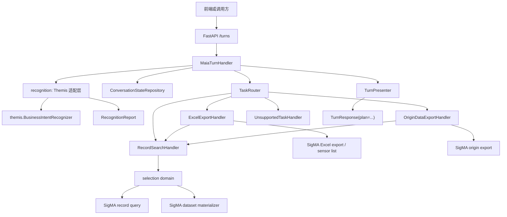
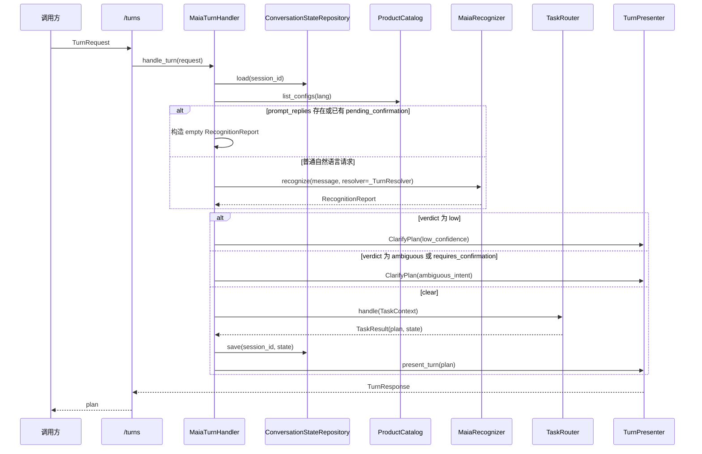
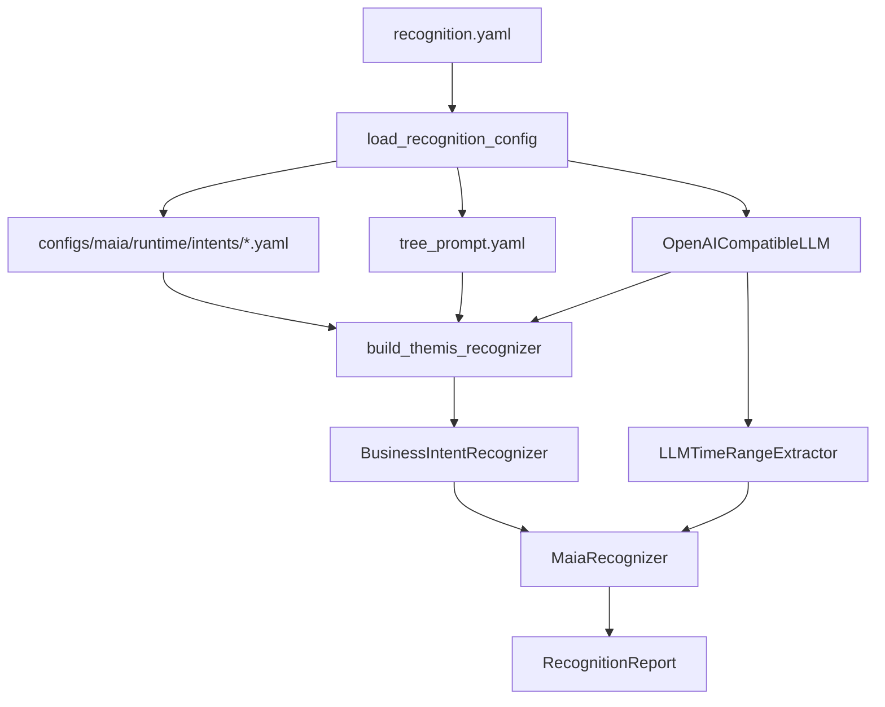
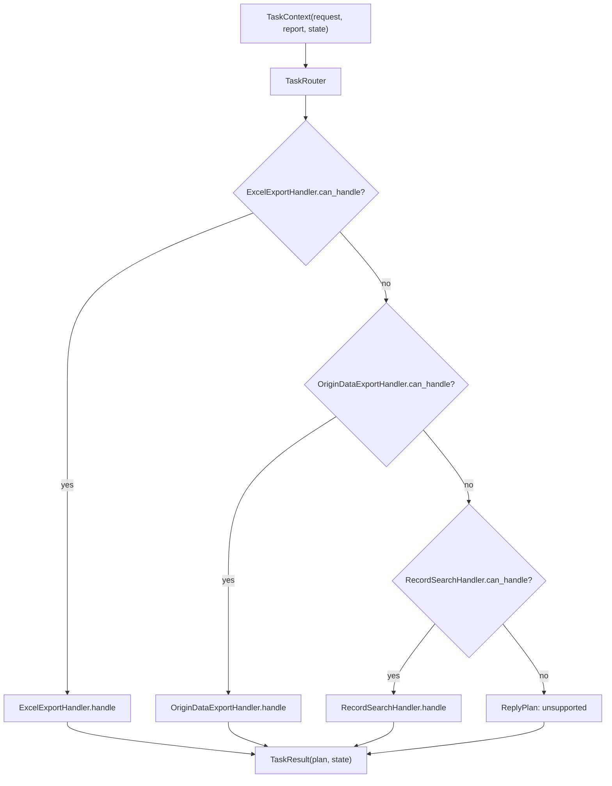
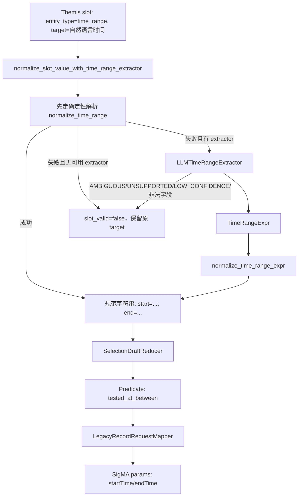
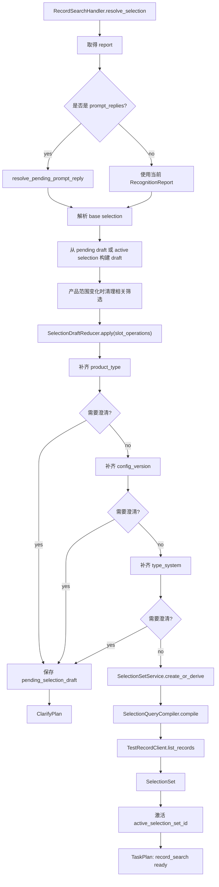
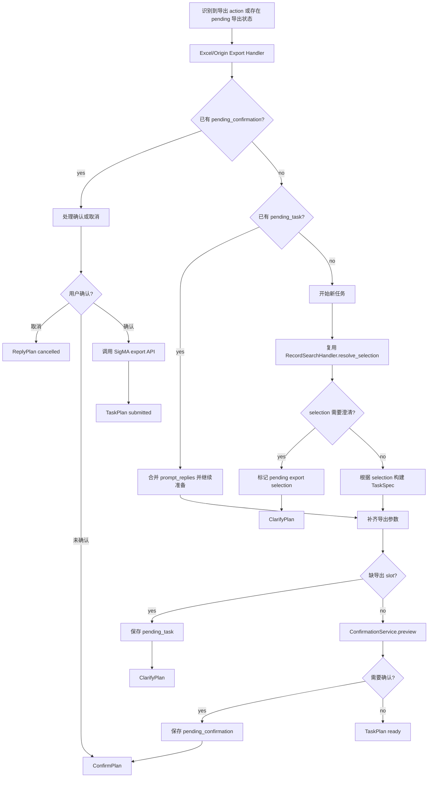

# SigMA Copilot 当前架构梳理

本文档记录当前 `src/maia` 的实际代码结构和请求流程，目标是帮助接手者快速理解 SigMA Copilot 如何从 `/turns` 请求走到识别、selection、任务计划和 SigMA 后端调用。

文档只描述当前实现，不作为目标架构或重构方案。

## 1. 总览

SigMA Copilot 是围绕 `/turns` 对话接口组织的 Python 应用。它把用户消息识别为业务意图，再基于识别结果和会话状态构建应用层 plan。

Themis 只负责意图识别和 slot/action 结果输出；SigMA Copilot 自己负责：

- 维护会话中的 selection、pending task、pending confirmation。
- 将 Themis decision 归一化为 `RecognitionReport`。
- 把 `slot_operations` 投影成记录筛选条件。
- 构建 `/turns` 的公开 `plan` 响应。
- 调用 legacy SigMA API 查询记录、物化数据集、提交导出任务。



## 2. 主要目录职责

| 路径 | 职责 |
| --- | --- |
| `src/maia/api` | `/turns` 公共请求和响应 Pydantic 合约，FastAPI app 入口。 |
| `src/maia/runtime.py` | 运行时装配和每轮请求编排。 |
| `src/maia/recognition` | Themis 适配、识别配置加载、slot 归一化、时间范围归一化。 |
| `src/maia/conversation` | 会话中的 selection draft、pending task、confirmation、引用解析。 |
| `src/maia/selection` | selection 表达式、查询编译、SelectionSet 存储和物化。 |
| `src/maia/tasks` | 任务路由和业务任务 handler。当前主要是记录检索、Excel 导出、Origin 数据导出。 |
| `src/maia/integrations/sigma` | legacy SigMA HTTP API 适配层和请求/响应 mapper。 |
| `src/maia/presentation` | 将内部 plan 投影成稳定 `/turns` 响应。 |
| `configs/maia/runtime` | 识别运行时配置、tree prompt、intent YAML。 |
| `configs/maia/contracts` | 对外 contract 文档，例如 turns response contract。 |

## 3. 启动和运行时装配

FastAPI 入口在 `maia.api.main.create_app`：

1. 创建 FastAPI app。
2. 配置 CORS。
3. 创建或复用 `MutableSigmaTokenProvider`。
4. 如果 `SIGMA_ENABLE_MAIA` 不是 `0`，默认调用 `create_maia_runtime()`。
5. 注册 `POST /turns`，把请求交给 turn handler。

`create_maia_runtime()` 负责组装默认依赖：

- `MaiaRecognizer`：默认从 `configs/maia/runtime/recognition.yaml` 构建。
- `ConversationStateRepository`：内存会话状态和 dataset binding。
- `InMemorySelectionSetRepository`：内存 SelectionSet 仓库。
- `SelectionQueryCompiler`：把 selection query 编译成记录查询。
- `SelectionSetService`：创建或派生 SelectionSet，必要时物化到 SigMA dataset。
- SigMA clients：记录查询、产品配置、dataset materializer、Origin 导出、Excel 导出、sensor list。
- `MaiaTurnHandler`：把上面依赖组合成每轮对话处理器。

默认 SigMA 连接信息：

- `SIGMA_BASE_URL`，默认值为 `http://192.168.0.65:8081`。
- `SIGMA_TOKEN`，由 `MutableSigmaTokenProvider` 读取和更新。

## 4. `/turns` 主流程

`MaiaTurnHandler.handle_turn()` 是当前最核心的编排入口。



关键点：

- `prompt_replies` 和 `pending_confirmation` 场景不会重新调用 recognizer，而是用 `_empty_report()` 让任务 handler 根据状态继续处理。
- `_TurnResolver` 会把产品配置转成 Themis resolver 候选，当前覆盖 `product_type`、`config_version`、`type_system`、`manual_tagging`、`summary_result`、`status`。
- `low` 和 `ambiguous` 在进入任务层之前就被转成 `ClarifyPlan`。
- 任务层只处理 `clear` 的识别报告或基于已有状态的继续流程。

## 5. 识别层

识别配置从 `configs/maia/runtime/recognition.yaml` 加载，包含：

- `intents_path`: intent YAML 目录。
- `tree_prompt_path`: Themis tree prompt 配置。
- `report_contract_path`: 识别报告契约。
- `llm`: OpenAI-compatible LLM 配置。
- `themis`: `alpha`、`delta`、`min_intent_score`、`build_index_on_init` 等 Themis 参数。

识别层入口是 `build_maia_recognizer_from_config()`：



`MaiaRecognizer` 做的是薄适配：

1. 调用 `BusinessIntentRecognizer.recognize()` 得到 Themis decision。
2. 从 decision 提取 `verdict`、`requires_confirmation`、`degraded`。
3. 把 `decision.intents`、`decision.action_intents`、`decision.slot_operations` 转成 SigMA Copilot 的 `RecognitionReport`。
4. 对 slot target 做归一化，例如时间范围、summary result、marking result。
5. 根据 `include_diagnostics` 决定是否保留 diagnostics。
6. 调用 `fill_summary_result_slots()` 补齐部分 summary result slot。

`RecognitionReport` 是任务层消费的稳定内部模型：

| 字段 | 说明 |
| --- | --- |
| `message` | 原始用户消息。 |
| `verdict` | `clear`、`ambiguous`、`low`。 |
| `requires_confirmation` | 识别层是否要求澄清。 |
| `degraded` | Themis 识别是否降级。 |
| `intents` | 原子意图和 slots，主要用于追踪和部分任务判断。 |
| `action_intents` | 最终动作意图，例如 `task.nvh.record_search`、`task.nvh.excel_export`。 |
| `slot_operations` | 应用层执行用 slot 操作视图。 |
| `diagnostics` | 调试信息，默认 `/turns` 不返回。 |

## 6. 会话状态

当前会话状态是内存实现，核心模型是 `ConversationSelectionState`：

| 字段 | 说明 |
| --- | --- |
| `active_selection_set_id` | 当前激活的 SelectionSet。 |
| `recent_selection_set_ids` | 最近使用过的 SelectionSet，用于引用解析。 |
| `pending_selection_draft` | 缺 slot 或等待 prompt reply 的 selection draft。 |
| `pending_task` | 缺少任务参数时保存的任务。 |
| `pending_confirmation` | 等待用户确认的高/中风险任务。 |
| `active_task_id` | 已提交的任务 ID。 |
| `version` | 状态版本，每次变化递增。 |

`ConversationStateRepository` 除了保存 `ConversationSelectionState`，还维护 `SessionDatasetBinding`：

- 用于把会话内多次 selection 物化到同一个 SigMA dataset。
- `RecordSearchHandler.materialize_selection()` 会读取和更新这个 binding。

## 7. TaskRouter 和任务层

`TaskRouter` 按注册顺序匹配 handler：

1. `ExcelExportHandler`
2. `OriginDataExportHandler`
3. `RecordSearchHandler`
4. `UnsupportedTaskHandler`

顺序很重要：Excel 和 Origin 导出都可能先进行 selection 解析，所以它们需要先于普通记录检索匹配。



`TaskResult` 总是包含：

- `plan`: 要返回给前端的 `TurnPlan`。
- `state`: 本轮结束后应保存的会话状态。

## 8. Selection 子系统

Selection 是 SigMA Copilot 当前最重要的领域模型。它把自然语言中的筛选条件转成稳定的记录集合。

### 8.1 SelectionDraft

`SelectionDraft` 是尚未完全确认或尚未物化的筛选草稿，包含：

- `base_selection_id`: 基于哪个已有 selection 派生。
- `expression`: `FilterExpression` 树。
- `sort`: 排序。
- `limit`: 限制条数，例如“最近 N 条”。
- `pending_questions`: 当前等待用户回答的问题。
- `revision`: draft 修订版本。

`SelectionDraftReducer` 消费 `RecognitionReport.slot_operations`，把 add/remove/replace/clear/exclude 等操作应用到 draft。

### 8.2 FilterExpression

筛选条件用表达式树表示：

- `Predicate`
- `AllOf`
- `AnyOf`
- `Not`

常见 entity 到 predicate 的映射在 `conversation.draft` 中维护，例如：

| entity_type | predicate |
| --- | --- |
| `product_type` | `product_type_in` |
| `config_version` | `config_version_in` |
| `type_system` | `type_system_in` |
| `sensor` | `sensor_in` |
| `summary_result` | `summary_result_in` |
| `time_range` | `tested_at_between` |

### 8.3 时间表达式解析

时间表达式不是在 selection 层直接解析原始自然语言，而是在识别适配层先归一化，再由 selection draft 转成筛选 predicate。

整体处理链路如下：



关键规则：

- `time_range` 是自校验 slot，不依赖 resolver 候选值。解析成功时 `slot_valid=true`，解析失败时 `slot_valid=false`。
- 规范格式统一为 `start=YYYY-MM-DD HH:MM:SS; end=YYYY-MM-DD HH:MM:SS`，也允许只有 `start=...` 或只有 `end=...`。
- 相对时间以运行时当前时间为锚点，代码中通过 `_now()` 取当前时间并去掉微秒。
- 确定性解析会先处理已有规范字符串，再处理常见中文时间表达式。
- 如果确定性解析失败且构建了 `LLMTimeRangeExtractor`，会让 LLM 只抽取结构化 `TimeRangeExpr`，最终 start/end 仍由本地代码计算。
- LLM 返回 `AMBIGUOUS`、`UNSUPPORTED`、`LOW_CONFIDENCE`，或 confidence 低于阈值、字段为空、字段超出白名单时，都会被视为无效时间 slot。
- 无效 `time_range` 进入 `SelectionDraftReducer` 时会触发 slot 无效错误，`RecordSearchHandler` 捕获后返回澄清计划，而不是静默忽略时间条件。

当前确定性解析覆盖的主要表达包括：

| 类型 | 示例 | 输出语义 |
| --- | --- | --- |
| 单日相对时间 | `今天`、`昨天`、`前天`、`大前天` | 对应自然日范围。 |
| 日历周期 | `本周`、`上周`、`本月`、`上个月`、`本季度`、`今年`、`去年` | 对应日历周期范围。 |
| 周内日期 | `上周六`、`上周日`、`本周三` | 对应指定自然日范围。 |
| 滚动窗口 | `最近7天`、`近2周`、`过去3个月`、`最近4小时`、`半个月` | 从当前锚点向前滚动。 |
| 起止范围 | `0611-0622`、`611到622`、`六月十一到六月二十二`、`6月到8月` | 起止日期范围。 |
| 单边边界 | `11号之前`、`6月之后`、`截止到12月25号`、`6月11号及之后` | 只生成 `start` 或 `end`。 |
| 从某时以来 | `5月以来`、`从六月开始`、`今年以来`、`月初到现在` | 起点到当前锚点。 |
| 部分日期 | `六月十一号`、`0611`、`20260611`、`6月`、`2026.06.11` | 用当前锚点补全年份或范围。 |
| 半年表达 | `今年上半年`、`今年下半年` | 对应半年范围。 |

在 selection draft 中，`time_range` 的 target 必须已经是规范字符串。`SelectionDraftReducer` 会调用 `time_range_params()` 把它拆成 `{"start": "...", "end": "..."}`，并构造：

```json
{
  "kind": "predicate",
  "name": "tested_at_between",
  "params": {
    "start": "2026-06-05 15:30:00",
    "end": "2026-06-12 15:30:00"
  }
}
```

后续 `LegacyRecordRequestMapper` 会把 `tested_at_between.params.start` 和 `tested_at_between.params.end` 分别映射成 SigMA 查询参数 `startTime` 和 `endTime`。如果是单边时间条件，只会输出对应一侧参数。

`latest_n` 与 `time_range` 是两条不同路径：`latest_n` 会更新 `SelectionDraft.limit`，并设置默认排序 `tested_at desc`；它不会构造 `tested_at_between` predicate。

### 8.4 SelectionSet

`SelectionSet` 是已经编译并保存的记录集合，包含：

- `selection_set_id`
- `expression`
- `sort`
- `limit`
- `record_count`
- `record_ids` 或 `snapshot_ref`
- `dataset_id`
- `selection_hash`
- `lineage`

`selection_hash` 基于表达式、排序、limit、记录集合和 source version 计算，用于复用相同 selection。

### 8.5 记录检索流程



`RecordSearchHandler` 还会通过 `DatasetProjector` 把 selection 投影到 `PlanDataset`，供前端拿到：

- `selection_set_id`
- `selection_hash`
- `dataset_id`
- `dataset_name`
- `record_count`
- `record_ids`
- `selection_params`

## 9. 查询编译和 SigMA 记录查询

`SelectionQueryCompiler` 把 `SelectionQuery` 编译成实际记录：

1. 解析 `FilterExpression`。
2. 对 pushdown-compatible 的 `Predicate` 或 `AllOf(Predicate...)` 直接调用 record client。
3. 对 `AnyOf` 做 union。
4. 对 `Not` 做 difference。
5. 对复杂 `AllOf` 做 intersection 和 difference。
6. 按 `sort` 排序。
7. 应用 `limit`。

`TestRecordClient` 再通过 `LegacyRecordRequestMapper` 把 `FilterExpression` 映射成 legacy SigMA HTTP query params，例如：

- `product_type_in` -> `type`
- `config_version_in` -> `versionList`
- `sensor_in` -> `sensorIdList`
- `summary_result_in` -> `sumList`
- `tested_at_between` -> `startTime` / `endTime`

返回值通过 `LegacyRecordResponseMapper` 转成 `TestRecordPage` 和 `TestRecordSummary`。

## 10. 导出任务流程

Excel 和 Origin 导出 handler 都复用 `RecordSearchHandler.resolve_selection()` 来得到 selection，然后各自补齐导出参数。



### 10.1 Excel 导出

Excel 导出 intent 是 `task.nvh.excel_export`。

准备阶段会检查或补齐：

- selection 是否存在且不为空。
- `type/systemNo` scope，来自选中记录。
- 可导出的 sensor 列表，来自 `SensorListClient`。
- 用户选择的 sensor。
- 导出的数据类型。

确认通过后调用 `ExcelExportClient.export()`。

### 10.2 Origin 数据导出

Origin 导出 intent 是 `task.nvh.origin_data_export`。

准备阶段会检查或补齐：

- selection 是否存在且不为空。
- 导出格式。
- `systemNo`，来自选中记录。

确认通过后调用 `OriginExportClient.export()`。

## 11. 对外响应模型

`maia.api.turns` 定义 `/turns` 的稳定响应外形。顶层响应只有：

```json
{
  "plan": {}
}
```

当前 plan kind 包括：

| kind | 用途 |
| --- | --- |
| `reply` | 普通回复或不支持任务。 |
| `clarify` | 需要用户补充 slot、选择候选或澄清意图。 |
| `confirm` | 中/高风险任务提交前确认。 |
| `task` | 可执行或已提交的业务任务。 |
| `context_update` | 上下文更新计划，当前模型保留。 |
| `context_clear` | 上下文清理计划，当前模型保留。 |

`TurnPresenter` 会把内部 `TurnPlan` 或 dict 重新校验为公开 `TurnResponse`，确保输出符合 Pydantic contract。

## 12. 配置和测试入口

常用配置：

| 路径 | 说明 |
| --- | --- |
| `configs/maia/runtime/recognition.yaml` | 识别运行时配置。 |
| `configs/maia/runtime/intents/*.yaml` | Themis intent YAML。 |
| `configs/maia/runtime/tree_prompt.yaml` | Themis tree prompt。 |
| `configs/maia/contracts/turns_response_contract.yaml` | `/turns` 响应契约。 |
| `configs/maia/contracts/recognition_report_contract.yaml` | recognition report 契约。 |

相关测试主要集中在：

| 测试 | 覆盖点 |
| --- | --- |
| `tests/test_maia_turns_api.py` | `/turns` API 包装和 app 行为。 |
| `tests/test_maia_turns_response_contract.py` | `/turns` 响应 contract。 |
| `tests/test_maia_runtime.py` | runtime 装配和 turn handler。 |
| `tests/test_maia_recognizer_adapter.py` | Themis decision 到 `RecognitionReport` 的适配。 |
| `tests/test_maia_selection_draft_reducer.py` | slot operations 到 selection draft 的投影。 |
| `tests/test_maia_selection_service.py` | SelectionSet 创建和派生。 |
| `tests/test_maia_selection_query_compiler.py` | FilterExpression 到记录集合的编译。 |
| `tests/test_maia_sigma_request_mapper.py` | selection 到 SigMA query params。 |
| `tests/test_maia_sigma_response_mapper.py` | SigMA 响应到内部 record model。 |
| `tests/test_maia_excel_export.py` | Excel 导出任务流程。 |
| `tests/test_maia_origin_data_export.py` | Origin 导出任务流程。 |

## 13. 当前边界和注意点

- SigMA Copilot 业务代码通过 Themis 公开 API 接入识别，不直接依赖 `intent_fusion`。
- Themis 不生成应用级执行计划；`TaskRouter` 和各 handler 是 SigMA Copilot 的应用计划构建层。
- 当前 repository 和会话状态是内存实现，进程重启会丢失。
- `ExcelExportHandler` 和 `OriginDataExportHandler` 会复用 `RecordSearchHandler`，所以 selection 逻辑是导出任务的前置依赖。
- `PlanDataset` 是公开 plan 的一部分，但 `SelectionSet`、confirmation token 等内部状态不会直接暴露。
- `diagnostics` 默认不进入 `/turns` 响应，只在识别适配层按需保留。
