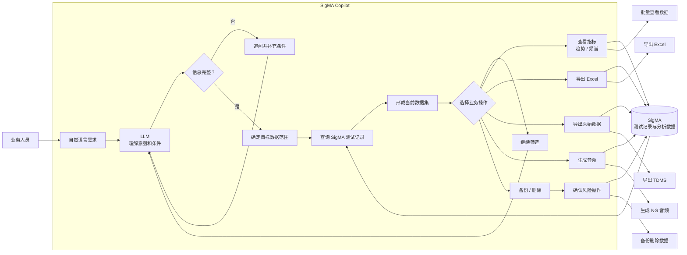

# SigMA Copilot 业务流程图

```mermaid
flowchart LR
    U["业务人员"]
    U --> A["自然语言需求"]

    subgraph MAIA["SigMA Copilot"]
        A --> L["LLM<br/>理解意图和条件"]
        L --> C{"信息完整？"}
        C -- "否" --> D["追问并补充条件"]
        D --> L
        C -- "是" --> E["确定目标数据范围"]
        E --> F["查询 SigMA 测试记录"]
        F --> G["形成当前数据集"]
        G --> H{"选择业务操作"}

        H --> I["继续筛选"]
        I --> L
        H --> J["查看指标<br/>趋势 / 频谱"]
        H --> K["导出 Excel"]
        H --> M["导出原始数据"]
        H --> N["生成音频"]
        H --> O["备份 / 删除"]
        O --> P["确认风险操作"]
    end

    S[("SigMA<br/>测试记录与分析数据")]
    S --> F
    J --> S
    K --> S
    M --> S
    N --> S
    P --> S

    J --> V1["批量查看数据"]
    K --> V2["导出 Excel"]
    M --> V3["导出 TDMS"]
    N --> V4["生成 NG 音频"]
    P --> V5["备份删除数据"]
```
