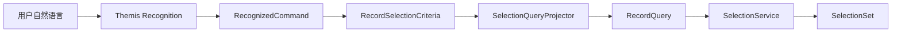
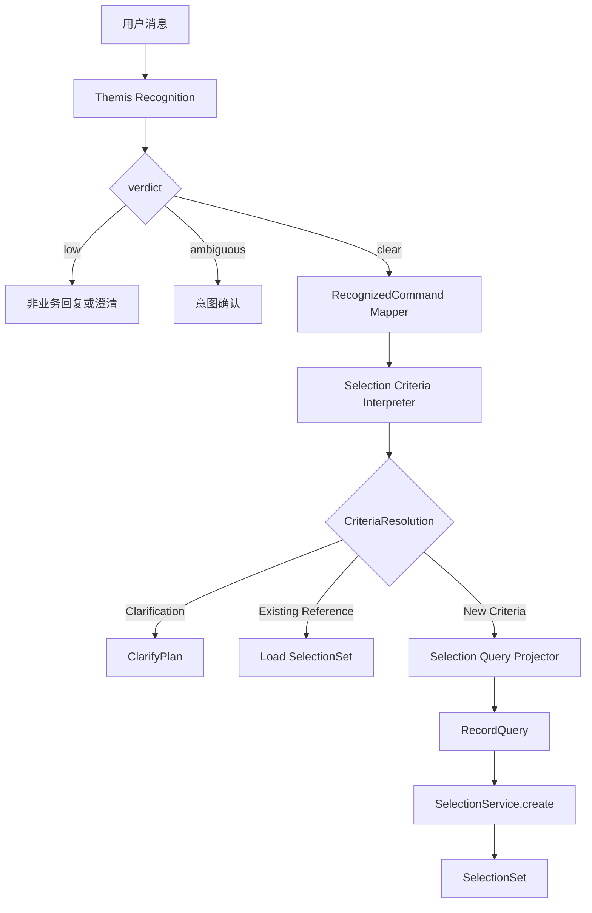
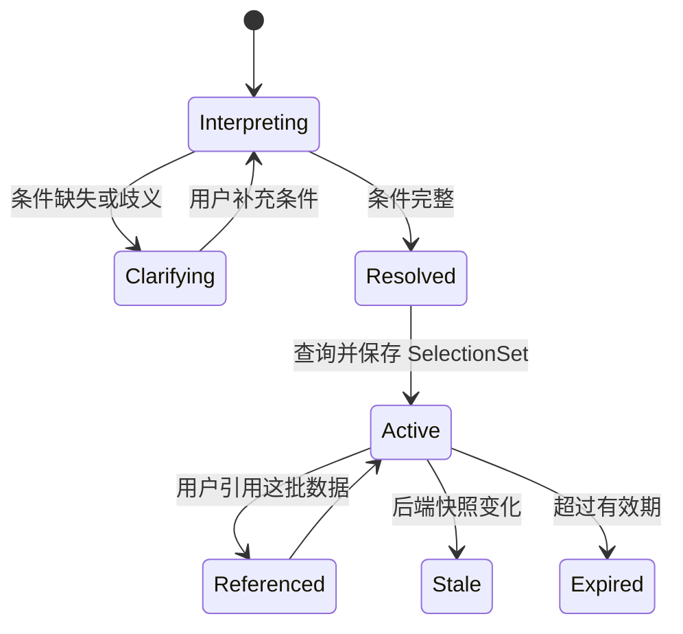
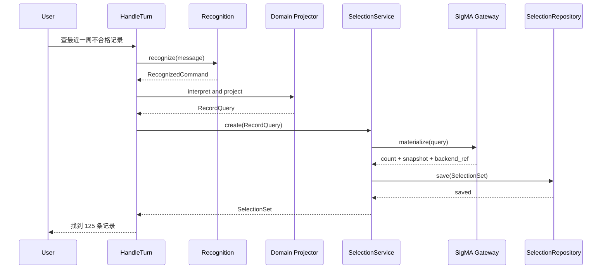
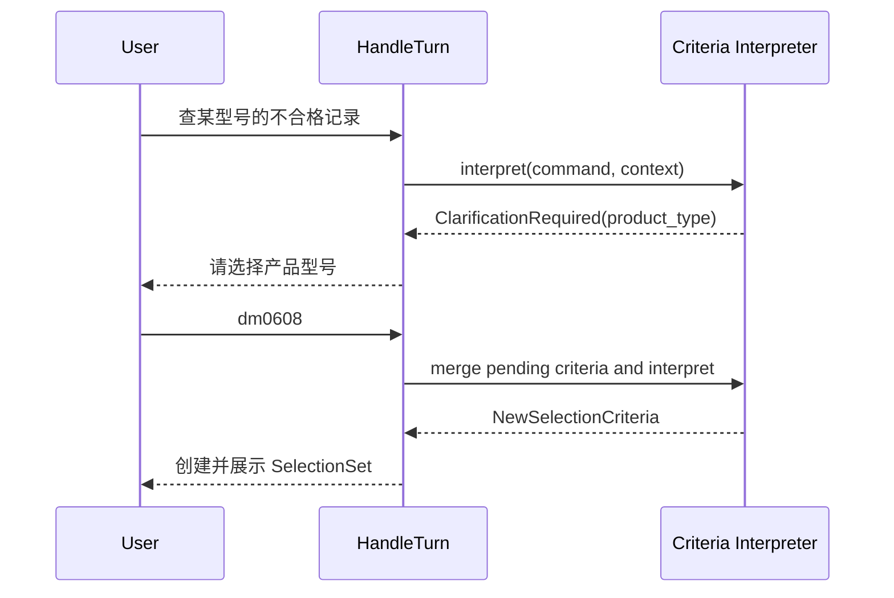
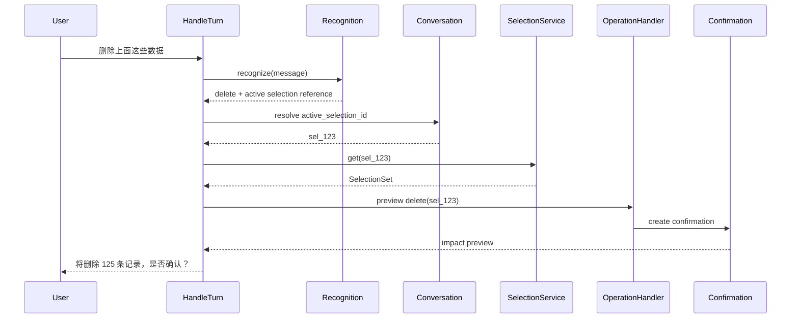
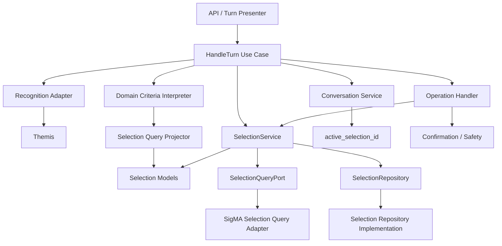
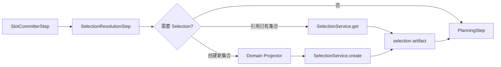
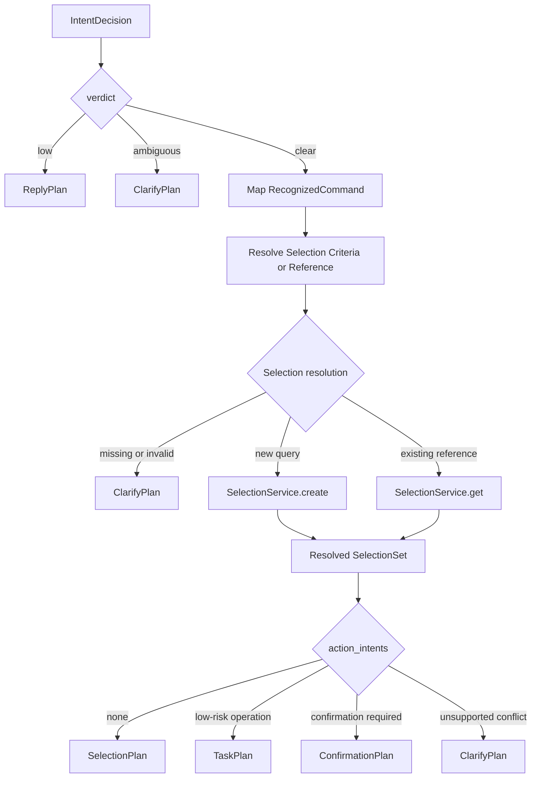

# SelectionSet 设计

## 1. 模型总览

```text
用户输入
  → Recognition 生成 RecognizedCommand
  → Domain Interpreter 生成 RecordSelectionCriteria
  → Domain Projector 生成 RecordQuery
  → SelectionService 查询并持久化 SelectionSet
  → Application 路由到对应 Operation
```

Themis 不直接生成 `SelectionSet`。它只负责提供：

- `decision.verdict`
- `decision.slot_operations`
- `decision.action_intents`
- 引用语义所需的识别结果

从自然语言到 `SelectionSet` 的转换必须经过稳定的应用内部语义层，避免让
Themis 类型、SigMA 参数或 SQL 细节渗透到 Selection 模型。



核心三层嵌套：

```text
SelectionSet
  └─ RecordQuery
       ├─ FilterExpression      ← 筛选条件树
       ├─ AggregationStrategy   ← 集合聚合（keepLast / onlyRepeatSerial）
       └─ SortRule / limit      ← 排序和数量限制
```

---

## 2. FilterExpression 节点库

### 2.1 组合节点

```python
AllOf(*children: FilterExpression)   # 全部满足
AnyOf(*children: FilterExpression)   # 任一满足
Not(child: FilterExpression)         # 取反
```

### 2.2 域语义节点

| 节点 | 参数 | 说明 |
|---|---|---|
| `ProductTypeMatch` | `configs: list[(type, version, system_no)]` | type + version + systemNo 复合元组，不可拆 |
| `ExcessLimitTupleMatch` | `tuples: list[(sensor, test_name, indicator)]` | 超限标签 tuple 集合，LLM 传 tuple 即可，匹配策略 (any/all) 下沉到 SigMA 集成层 |
| `TimeBetween` | `start, end` | 时间窗口 |
| `StringContains` | `field, value` | 模糊匹配，对应后端 `LIKE %value%` |
| `StringEquals` | `field, value` | 精确匹配 |
| `FieldIn` | `field, values` | 枚举匹配（多选） |
| `FieldEquals` | `field, value` | 标量精确匹配 |

### 2.3 业务字段映射表

| API 参数 | FilterExpression 节点 | 备注 |
|---|---|---|
| `type` + `versionList` + `systemNoList` | `ProductTypeMatch` | 三个字段笛卡尔积展开为 configs 列表 |
| `serialNo` | `StringContains(field="serial_no", value=...)` | MySQL `LIKE %value%` |
| `sensorIdList` + `testNameList` + `indicatorList` | `ExcessLimitTupleMatch` | 笛卡尔积展开为 tuples 列表 |
| `startTime` / `endTime` | `TimeBetween` | |
| `sumList` | `FieldIn(field="judgement_result", values=...)` | |
| `manualTagging` | `FieldEquals(field="manual_verdict", value=...)` | |
| `status` | `FieldEquals(field="record_status", value=...)` | |
| `testSection` | `FieldEquals(field="test_section", value=...)` | |
| `remark` | `StringContains(field="remark", value=...)` | |
| `archive` | `FieldEquals(field="archived", value=...)` | |

---

## 3. AggregationStrategy

不属于字段过滤，而是**集合聚合层面的处理**：

```python
@dataclass
class AggregationStrategy:
    keep_last_per_serial: bool = False     # 每个 serialNo 只保留最新一条
    only_repeat_serials: bool = False      # 仅保留出现多次的 serialNo
```

为什么独立于 FilterExpression：`keepLast` / `onlyRepeatSerial` 改变的是"如何从候选集合中选定最终记录"，而非"哪些记录进入候选"。

---

## 4. SelectionSet 主模型

```python
@dataclass
class RecordQuery:
    expression: FilterExpression
    aggregate: AggregationStrategy | None = None
    sort: tuple[SortRule, ...] = ()
    limit: int | None = None


@dataclass
class SortRule:
    field: str
    direction: Literal["asc", "desc"]


@dataclass
class SelectionSet:
    id: str
    query: RecordQuery
    backend_ref: str | None = None
    record_count: int = 0
    snapshot_version: str = ""
    content_hash: str = ""
    created_at: datetime | None = None
    expires_at: datetime | None = None
```

---

## 5. QueryExecutionOptions

分页和内容开关**不进入 SelectionSet 定义**，只影响某次查询的执行方式：

```python
@dataclass
class QueryExecutionOptions:
    page: int = 1
    page_size: int = 20
    include_pdf_report: bool = False
    include_result_data: bool = False
    include_origin_data: bool = False
    include_color_map: bool = False
```

原因：

- `SelectionSet` 描述"哪些记录"（集合定义）
- `QueryExecutionOptions` 描述"怎么取出来看"（执行选项）
- "删除上面这些数据"引用的是集合定义，不受分页影响

---

## 6. 完整示例

### 当前 API 请求

```
type=dm0608
systemNoList=7s-SNF1001
versionList=3,4
serialNo=S1F
sensorIdList=sensor01,sensor02
testNameList=Std-D
indicatorList=倒频谱-0.2
startTime=2026-06-01 00:00:00
endTime=2026-06-10 14:16:19
sumList=不合格
manualTagging=合格
testSection=12
status=合格
remark=2321
archive=false
keepLast=false
onlyRepeatSerial=false
page=1, rows=20
```

### 转换后的 SelectionSet

```python
SelectionSet(
    id="sel_20260610_a1b2c3",
    query=RecordQuery(
        expression=AllOf(
            ProductTypeMatch(configs=[
                ("dm0608", "3", "7s-SNF1001"),
                ("dm0608", "4", "7s-SNF1001"),
            ]),
            StringContains(field="serial_no", value="S1F"),
            ExcessLimitTupleMatch(tuples=[
                ("sensor01", "Std-D", "倒频谱-0.2"),
                ("sensor02", "Std-D", "倒频谱-0.2"),
            ]),
            TimeBetween(
                start=datetime(2026, 6, 1, 0, 0, 0),
                end=datetime(2026, 6, 10, 14, 16, 19),
            ),
            FieldIn(field="judgement_result", values=["不合格"]),
            FieldEquals(field="manual_verdict", value="合格"),
            FieldEquals(field="record_status", value="合格"),
            FieldEquals(field="test_section", value=12),
            StringContains(field="remark", value="2321"),
            FieldEquals(field="archived", value=False),
        ),
        aggregate=AggregationStrategy(
            keep_last_per_serial=False,
            only_repeat_serials=False,
        ),
    ),
    record_count=0,    # 查询后回填
    ...
)
```

---

## 7. 职责边界

```text
Recognition (Themis Adapter)
  ├─ 把 Themis 结果转换为应用自己的 RecognizedCommand
  ├─ 输出 intent、slot change 和 reference intent
  └─ 不生成 FilterExpression、SelectionSet 或 SigMA 参数

Domain (Data Management)
  ├─ 解释测试记录筛选语义
  ├─ 生成 RecordSelectionCriteria
  ├─ 把业务条件投影为 RecordQuery
  └─ 不访问仓储、不调用 SigMA

Selection
  ├─ 定义 SelectionSet / RecordQuery / 通用 FilterExpression
  ├─ 创建、读取、刷新、过期和引用 SelectionSet
  └─ 不定义删除、导出、报告或重计算规则

Integration (SigMA Selection Query Adapter)
  ├─ 把 RecordQuery 翻译为实际查询
  ├─ ProductTypeMatch -> 笛卡尔积 OR 查询
  ├─ ExcessLimitTupleMatch -> 笛卡尔积 any/all 查询
  ├─ StringContains -> LIKE %value%
  └─ 不定义领域模型

Application
  ├─ 编排 Recognition、Domain Projector 和 SelectionService
  ├─ 创建 / 复用 SelectionSet
  └─ 路由到 Operation Handler

Conversation
  ├─ 保存 active_selection_id / recent_selection_ids
  └─ 不复制完整 SelectionSet

Operation
  ├─ 通过 selection_id 使用已选记录集合
  └─ 不重新解释自然语言或重建筛选条件
```

### 7.1 Selection 包的能力边界

`selection/` 回答的是“哪些记录属于同一个稳定集合”，能力包括：

- 定义不可变的集合模型和查询模型。
- 规范化查询并计算稳定 hash。
- 创建、读取、刷新和过期 `SelectionSet`。
- 解析“上面这些数据”“刚才那批记录”等集合引用。
- 通过抽象端口获取记录数量、快照版本和后端引用。
- 通过抽象仓储持久化集合实体。

`selection/` 明确不负责：

- 直接调用 Themis 或解释 Themis 原始对象。
- 定义产品、传感器、超限指标等业务规则。
- 构建删除、导出、报告或重计算任务。
- 管理完整会话状态。
- 拼装 API `TurnPlan`。
- 生成 SQL 或 SigMA HTTP 参数。

### 7.2 与 SlotState 的区别

当前 `SlotState` 表达的是会话中的可变参数，例如当前传感器、测试段或指标。
`SelectionSet` 表达的是已经解析并持久化的记录集合。

| 对比项 | `SlotState` | `SelectionSet` |
|---|---|---|
| 语义 | 当前对话参数 | 稳定记录集合 |
| 生命周期 | 随会话修改 | 创建后按 ID 引用 |
| 是否可变 | 可通过 slot operation 更新 | 原则上不可变，刷新产生新快照 |
| 外部数据绑定 | 不一定 | 绑定 snapshot/version/hash |
| 下游使用方式 | 构建查询或任务参数 | 通过 `selection_id` 执行操作 |

因此不能直接把当前 `SlotState` 当成 `SelectionSet`，也不应把
`SelectionSet` 的完整内容复制进会话状态。

---

## 8. 与批量观察场景的隔离

同一个传感器/指标字段名在两个场景语义完全不同：

| 场景 | 节点类型 | 语义 |
|---|---|---|
| 测试记录查询 | `ExcessLimitTupleMatch` | 筛选"存在超限标签组合"的记录 |
| 批量数据观察 | `SensorSelector` / `IndicatorSelector`（待设计） | 选择要观察哪列数据 |

两个场景走**不同节点类型**，不会在模型层产生歧义。

---

## 9. 推荐实现位置

目标目录按照 `REFACTORING.md` 的职责边界组织：

```text
src/synapse/
  selection/
    __init__.py
    models.py                  # SelectionSet / RecordQuery / SortRule
    filters.py                 # 通用组合和字段表达式
    normalization.py           # 查询规范化、稳定序列化、hash
    service.py                 # create / get / refresh / expire
    repository.py              # SelectionRepository 协议
    query_port.py              # SelectionQueryPort 协议
    references.py              # 集合引用解析

  domains/
    data_management/
      selection_criteria.py    # RecordSelectionCriteria
      selection_projector.py   # Criteria -> RecordQuery
      selection_filters.py     # ProductTypeMatch 等业务节点

  integrations/
    sigma/
      selection_query.py       # RecordQuery -> SigMA 请求
      selection_mapper.py      # SigMA 响应 -> 查询结果元数据

  infrastructure/
    persistence/
      selection_repo.py        # SelectionRepository 实现

  application/
    resolve_selection.py       # 编排已有引用或新建 SelectionSet
```

放置规则：

- `selection/models.py` 只放稳定模型，不依赖 Themis、FastAPI 或 SigMA。
- `selection/filters.py` 放 `AllOf`、`AnyOf`、`Not`、`FieldEquals` 等通用节点。
- `ProductTypeMatch`、`ExcessLimitTupleMatch` 等测试记录业务语义优先放
  `domains/data_management/selection_filters.py`。
- `selection/service.py` 只通过 `SelectionQueryPort` 和
  `SelectionRepository` 工作。
- `integrations/sigma/selection_query.py` 负责协议转换，不拥有领域规则。
- `application/resolve_selection.py` 负责调用顺序，不逐字段拼
  `FilterExpression`。

不建议增加一个同时负责 LLM 解析、Filter 构造、SigMA 查询和持久化的
`SelectionSetBuilder`。这种对象会迅速成为新的 God Code。

---

## 10. 自然语言到 SelectionSet

### 10.1 稳定中间语义

自然语言不能直接转换成 `FilterExpression`。Recognition 层应先隔离
Themis 对象，形成应用自己的语义模型：

```python
@dataclass(frozen=True)
class RecognizedCommand:
    verdict: str
    slot_changes: tuple[SlotChange, ...]
    actions: tuple[ActionIntent, ...]
    references: tuple[ReferenceIntent, ...]
    diagnostics: Mapping[str, object]
```

数据管理域再将其解释为与具体查询后端无关的筛选条件：

```python
@dataclass(frozen=True)
class RecordSelectionCriteria:
    product_configs: tuple[ProductConfig, ...] = ()
    serial_contains: str | None = None
    excess_limit_tuples: tuple[ExcessLimitTuple, ...] = ()
    time_range: TimeRangeCriteria | None = None
    judgement_results: tuple[str, ...] = ()
    manual_verdict: str | None = None
    record_status: str | None = None
    test_section: int | None = None
    remark_contains: str | None = None
    archived: bool | None = None
    keep_last_per_serial: bool = False
    only_repeat_serials: bool = False
    sort: tuple[SortRule, ...] = ()
    limit: int | None = None
```

这个对象的价值是把三类契约分开：

- Themis 可以调整公开识别结果的适配方式，而不影响 Selection 模型。
- 业务筛选规则可以独立测试，而不需要运行 LLM。
- SigMA 请求格式可以变化，而不影响自然语言解释。

### 10.2 转换结果类型

Domain Interpreter 不应只返回 `RecordQuery` 或抛出模糊异常。它需要明确表达
“新建集合”“引用已有集合”和“需要澄清”三种结果：

```python
@dataclass(frozen=True)
class NewSelectionCriteria:
    criteria: RecordSelectionCriteria


@dataclass(frozen=True)
class ExistingSelectionReference:
    selection_id: str


@dataclass(frozen=True)
class SelectionClarificationRequired:
    missing_fields: tuple[str, ...] = ()
    ambiguous_fields: tuple[str, ...] = ()


CriteriaResolution = (
    NewSelectionCriteria
    | ExistingSelectionReference
    | SelectionClarificationRequired
)
```

### 10.3 推荐转换步骤



转换规则示例：

| 用户表达 | 中间语义 | `RecordQuery` 投影 |
|---|---|---|
| 最近一周 | `RelativeTimeRange(last_days=7)` | 注入 `Clock` 后生成 `TimeBetween` |
| 最近 100 条 | `RecentRecords(limit=100)` | `created_at desc` + `limit=100` |
| 不合格记录 | `judgement_results=("不合格",)` | `FieldIn("judgement_result", ...)` |
| 每件只留最新一条 | `keep_last_per_serial=True` | `AggregationStrategy` |
| 上面这些数据 | `ActiveSelectionReference` | 加载 `active_selection_id` |
| 删除上面这些数据 | delete action + selection reference | 不重建查询，复用 `selection_id` |

相对时间必须通过注入的 `Clock` 转换为绝对时间。否则同一条
`SelectionSet` 在不同时间执行会指向不同记录，无法稳定计算 content hash。

### 10.4 应用层编排

应用层可以依赖下面的抽象，但不应自己实现字段映射：

```python
class SelectionCriteriaInterpreter(Protocol):
    def interpret(
        self,
        command: RecognizedCommand,
        context: ConversationContext,
    ) -> CriteriaResolution: ...


class SelectionQueryProjector(Protocol):
    def project(
        self,
        criteria: RecordSelectionCriteria,
        *,
        now: datetime,
    ) -> RecordQuery: ...


class SelectionService:
    async def create(
        self,
        query: RecordQuery,
        scope: SelectionScope,
    ) -> SelectionSet: ...

    async def get(self, selection_id: str) -> SelectionSet: ...

    async def refresh(self, selection_id: str) -> SelectionSet: ...
```

创建流程建议固定为：

1. 规范化 `RecordQuery`。
2. 计算 query hash。
3. 通过 `SelectionQueryPort` 查询记录数量和快照信息。
4. 生成稳定 `selection_id`。
5. 构建并持久化 `SelectionSet`。
6. Application 更新会话中的 `active_selection_id`。
7. Application 构建对外 plan。

条件缺失或存在歧义时不能创建半完整的 `SelectionSet`，应返回
`SelectionClarificationRequired`。

---

## 11. 交互设计

用户交互中的核心对象是“这批数据”，系统内部必须始终使用稳定
`selection_id` 表达这批数据。

### 11.1 用户可见状态



`Resolved` 是短暂的应用内状态，表示已经得到 `RecordQuery`，但尚未完成
查询和持久化。只有进入 `Active` 后，才能被后续操作稳定引用。

### 11.2 正常查询流程



### 11.3 条件澄清流程

条件不完整时不创建 SelectionSet。应用保存的是待补充的 criteria 证据，而不是
虚假的空集合。



### 11.4 引用已有集合



确认时必须重新校验 `selection_hash` 和 `snapshot_version`。如果集合已经变化，
系统应标记为 stale，并要求重新预览。

### 11.5 建议展示字段

Selection 展示模型至少应具备：

- `selection_id`
- 人类可读的筛选条件摘要
- `record_count`
- `snapshot_version`
- `created_at`
- `expires_at`
- `stale` / `expired` 状态
- 当前集合允许执行的操作

当前公开响应格式尚未包含这些字段。初期实现应先作为内部 artifact 接入，
不能未经评审直接修改现有 API Schema 或 `TurnPlan`。

---

## 12. 组件设计

### 12.1 组件图



### 12.2 依赖方向

- `recognition` 输出 `RecognizedCommand`，不依赖 `selection`。
- `domains/data_management` 可以依赖 `selection.models` 和
  `selection.filters`，用于生成 `RecordQuery`。
- `selection` 不依赖任何具体 domain。
- `selection.service` 依赖端口协议，不依赖 SigMA 或数据库实现。
- `integrations/sigma` 可以依赖 `selection` 模型并实现查询端口。
- `infrastructure/persistence` 可以依赖 `selection.repository` 并实现仓储。
- `conversation` 只保存 selection 引用，不拥有 Selection 模型生命周期。
- `operations` 通过 `SelectionService` 按 ID 读取集合。
- `api` 只消费 application 输出，不直接访问 SelectionRepository。

推荐的依赖关系：

```text
api -> application
application -> recognition + domains + selection + operations + conversation
domains -> selection models
selection service -> selection ports
integrations -> selection ports/models
infrastructure -> selection repository protocol
```

禁止的反向依赖：

```text
selection -> themis
selection -> integrations.sigma
selection -> api
selection -> operations
domains -> infrastructure
integrations -> application
```

---

## 13. 独立可测试性

Selection 模块必须可以在不启动 LLM、HTTP 服务和真实数据库的情况下测试。

### 13.1 外部依赖端口

```python
@dataclass(frozen=True)
class SelectionMaterialization:
    backend_ref: str | None
    record_count: int
    snapshot_version: str
    content_hash: str


class SelectionQueryPort(Protocol):
    async def materialize(
        self,
        query: RecordQuery,
        scope: SelectionScope,
    ) -> SelectionMaterialization: ...


class SelectionRepository(Protocol):
    async def save(self, selection: SelectionSet) -> None: ...
    async def get(self, selection_id: str) -> SelectionSet | None: ...


class Clock(Protocol):
    def now(self) -> datetime: ...


class SelectionIdGenerator(Protocol):
    def new_id(self) -> str: ...
```

测试中使用：

- `FakeSelectionQueryPort`
- `InMemorySelectionRepository`
- `FixedClock`
- `StubSelectionIdGenerator`

### 13.2 测试分层

| 测试文件 | 主要覆盖 |
|---|---|
| `test_selection_filters.py` | 组合表达式、相等性和不可变性 |
| `test_selection_normalization.py` | 稳定序列化、排序和 query hash |
| `test_record_selection_projector.py` | criteria 到 `RecordQuery` 的纯转换 |
| `test_selection_service.py` | 创建、读取、刷新、过期和持久化 |
| `test_selection_references.py` | active、recent、缺失、过期引用 |
| `test_sigma_selection_query.py` | `RecordQuery` 到 SigMA 参数映射 |
| `test_selection_turn_characterization.py` | 固定 recognition decision 到 plan 的主链路 |

Domain projector 测试直接构造 `RecognizedCommand` 或
`RecordSelectionCriteria`，不能为了测试查询投影而调用真实 LLM。

SigMA adapter 测试只验证协议映射，不能同时验证自然语言识别。

### 13.3 最低测试场景

- 单一字段筛选。
- 多字段 `AllOf`。
- `AnyOf` 和 `Not`。
- 产品 type/version/system_no 复合 tuple。
- sensor/test_name/indicator 超限 tuple。
- 相对时间转绝对时间。
- 最近 N 条的排序和 limit。
- `keep_last_per_serial` 和 `only_repeat_serials`。
- 空候选、无结果和多候选。
- 引用 active selection。
- 引用不存在或已过期 selection。
- refresh 后 snapshot/hash 变化。
- 高危操作确认前 selection 已 stale。

---

## 14. 当前仓库的渐进接入

当前运行链路大致为：

```text
Recognition
  -> SlotResolution
  -> SlotValidation
  -> SlotCommitter
  -> PlanningStep
```

第一阶段可以在 `SlotCommitterStep` 后、`PlanningStep` 前增加一个很薄的
Selection 应用步骤：

```text
Recognition
  -> SlotResolution
  -> SlotValidation
  -> SlotCommitter
  -> SelectionResolutionStep
  -> PlanningStep
```



`SelectionResolutionStep` 只能负责适配当前 Conductor artifact 和调用应用用例。
它不能包含具体筛选规则、SigMA 参数映射或持久化实现。

建议分阶段实施：

1. 先实现纯模型、FilterExpression 和 normalization 测试。
2. 实现 data management criteria/projector，并用固定输入做单元测试。
3. 实现 repository/query port 和纯内存 fake。
4. 实现 `SelectionService`。
5. 增加 `SelectionResolutionStep`，只在测试记录查询意图上启用。
6. 把 `selection_id` 作为内部 artifact 传给现有 planner。
7. 增加 conversation 中的 active selection 引用。
8. 最后单独评审 API 展示模型和持久化实现。

这个顺序不要求重写当前 `TaskPlanBuilder`，也不改变现有公开 API、Pydantic
Schema、意图 YAML 或 Resolver 契约。

---

## 15. Themis 输出与 Final Plan 生成

Themis 的职责终止于 `IntentDecision`。它不生成 `SelectionSet`、`OperationRequest`
或最终前端 plan。

### 15.1 slot_operations 与 action_intents

当前 Themis 使用结构规则区分两者：

```python
has_slot_operation = bool(
    intent.slots.action
    or intent.slots.entity_type
    or intent.slots.target
)
```

- 任一 slot 字段非空，该 intent 进入 `decision.slot_operations`。
- 三个 slot 字段都为空，该 intent 进入 `decision.action_intents`。
- 该规则与 intent 名称无关。
- `slots.action` 表示 `replace/add/remove` 等 slot 修改，不表示删除、导出等业务操作。

因此“删除最近一周不合格记录”应拆成三个原子 intent：

```json
{
  "intents": [
    {
      "name": "task.nvh.record_selection.filter.time_range",
      "score": 0.96,
      "slots": {
        "action": "replace",
        "entity_type": "record_time_range",
        "target": "relative:last_7_days",
        "slot_valid": true
      }
    },
    {
      "name": "task.nvh.record_selection.filter.judgement",
      "score": 0.95,
      "slots": {
        "action": "replace",
        "entity_type": "record_judgement",
        "target": "NG",
        "slot_valid": true
      }
    },
    {
      "name": "task.nvh.data_management.records.delete",
      "score": 0.97,
      "slots": {
        "action": "",
        "entity_type": "",
        "target": "",
        "slot_valid": true
      }
    }
  ]
}
```

Themis 的业务视图为：

```json
{
  "slot_operations": [
    {
      "intent": "task.nvh.record_selection.filter.time_range",
      "score": 0.96,
      "action": "replace",
      "entity_type": "record_time_range",
      "target": "relative:last_7_days",
      "slot_valid": true
    },
    {
      "intent": "task.nvh.record_selection.filter.judgement",
      "score": 0.95,
      "action": "replace",
      "entity_type": "record_judgement",
      "target": "NG",
      "slot_valid": true
    }
  ],
  "action_intents": [
    {
      "name": "task.nvh.data_management.records.delete",
      "score": 0.97,
      "slots": {
        "action": "",
        "entity_type": "",
        "target": "",
        "slot_valid": true
      }
    }
  ]
}
```

业务 Operation intent 不能错误地携带 `action="remove"`。否则它会被 Themis
归入 `slot_operations`，无法作为终止动作被应用层路由。

### 15.2 TimeRange 编码

当前 Themis 的 `IntentSlot.target` 是字符串，不能直接承载：

```json
{
  "start": "2026-06-01T00:00:00+08:00",
  "end": "2026-06-10T23:59:59+08:00"
}
```

在不修改 Themis 公开 API 的前提下，一个时间段应作为一个原子字符串传递。
推荐使用 ISO 8601 interval：

```text
2026-06-01T00:00:00+08:00/2026-06-10T23:59:59+08:00
```

相对时间使用明确的语义 token：

```text
relative:last_7_days
relative:today
relative:current_month
```

Domain Interpreter 负责将字符串解析为：

```python
@dataclass(frozen=True)
class TimeRangeCriteria:
    start: datetime
    end: datetime
```

它必须校验：

- 时间格式合法。
- `start <= end`。
- 时区明确；无时区输入按请求工作区时区解释。
- 相对时间通过注入的 `Clock` 固化为绝对时间。
- 开始和结束边界是否包含采用统一规则。

多个离散时间段由多个同 entity type 的原子 intent 表达：

```json
{
  "slot_operations": [
    {
      "intent": "task.nvh.record_selection.filter.time_range",
      "action": ["replace", "add"],
      "entity_type": "record_time_range",
      "target": [
        "2026-06-01T00:00:00+08:00/2026-06-03T23:59:59+08:00",
        "2026-06-07T00:00:00+08:00/2026-06-09T23:59:59+08:00"
      ],
      "slot_valid": [true, true]
    }
  ]
}
```

应用层将其投影为：

```python
AnyOf(
    TimeBetween(start_1, end_1),
    TimeBetween(start_2, end_2),
)
```

不建议将一个区间拆成独立的 `start_time` 和 `end_time` slot。多个区间出现时，
这种设计无法可靠保持 start/end 配对。

对应 slot 配置建议为用户输入类型：

```yaml
record_time_ranges:
  kind: "user"
  entity_type: "record_time_range"
  required: false
  multi: true
```

`slot_valid=true` 只表示 Themis 没有发现 Resolver 冲突，不能替代应用层的时间
格式和范围校验。

### 15.3 Final Plan 决策顺序

Application 必须先解析并固定 Selection，再生成 Operation plan：



处理顺序固定为：

1. 处理 `decision.verdict`。
2. 将 `slot_operations` 映射为 Selection criteria 或 selection reference。
3. 校验并创建、派生或加载 `SelectionSet`。
4. 将每个 `action_intent` 映射为 `OperationRequest`。
5. 把 `selection_id`、`content_hash` 和 `snapshot_version` 绑定到 Operation。
6. 执行 handler validation 和 impact preview。
7. 根据风险策略生成 final plan。

不能先创建 Operation 再异步猜测其操作对象。

### 15.4 目标 Final Plan 联合

目标模型建议为：

```python
FinalPlan = (
    ReplyPlan
    | ClarifyPlan
    | SelectionPlan
    | TaskPlan
    | ConfirmationPlan
)
```

这里的 `FinalPlan` 是逻辑名称，API 层仍可沿用 `TurnPlan`。这是目标设计，
不是对当前公开 Pydantic Schema 的直接修改。

#### SelectionPlan

用户只查询或筛选记录，没有请求后续 Operation：

```json
{
  "kind": "selection",
  "status": "ready",
  "selection": {
    "selection_id": "sel_20260610_a1b2c3",
    "summary": "2026-06-04 至 2026-06-10 的不合格记录",
    "record_count": 125,
    "snapshot_version": "sigma-v184",
    "content_hash": "sha256:...",
    "created_at": "2026-06-10T15:30:00+08:00",
    "expires_at": "2026-06-11T15:30:00+08:00",
    "stale": false
  },
  "available_operations": [
    "trend_analysis",
    "data_export",
    "data_backup",
    "data_delete",
    "report_generation"
  ],
  "message": "找到 125 条记录。"
}
```

#### TaskPlan

一句话同时包含 Selection 和不需要确认的 Operation：

```json
{
  "kind": "task",
  "status": "ready",
  "name": "trend_analysis",
  "title": "生成不合格记录趋势",
  "risk_level": "low",
  "requires_confirmation": false,
  "selection": {
    "selection_id": "sel_20260610_a1b2c3",
    "content_hash": "sha256:...",
    "snapshot_version": "sigma-v184",
    "record_count": 125
  },
  "params": {
    "group_by": "day"
  },
  "message": "已基于 125 条记录创建趋势分析任务。"
}
```

#### ConfirmationPlan

一句话同时包含 Selection 和高风险 Operation：

```json
{
  "kind": "confirmation",
  "status": "awaiting_confirmation",
  "operation": {
    "operation_id": "op_delete_01",
    "operation_type": "data_delete",
    "selection_id": "sel_20260610_a1b2c3",
    "selection_hash": "sha256:...",
    "snapshot_version": "sigma-v184",
    "risk_level": "high",
    "idempotency_key": "delete:sel_20260610_a1b2c3:sigma-v184"
  },
  "preview": {
    "affected_records": 125,
    "summary": "将永久删除最近一周的 125 条不合格记录。"
  },
  "confirmation": {
    "token": "confirm_...",
    "expires_at": "2026-06-10T15:40:00+08:00"
  },
  "message": "该操作将永久删除 125 条记录，请确认。"
}
```

#### ClarifyPlan

Selection 条件缺失时必须保留待执行 Operation：

```json
{
  "kind": "clarify",
  "reason": "missing_selection_criteria",
  "message": "请选择要删除记录的产品型号。",
  "pending_operation": {
    "operation_type": "data_delete",
    "partial_criteria": {
      "judgement_results": ["NG"],
      "time_range": "relative:last_7_days"
    }
  },
  "missing_fields": ["product_type"],
  "prompts": [
    {
      "id": "product_type",
      "target": "slot",
      "label": "产品型号",
      "message": "请选择产品型号。",
      "required": true,
      "input_type": "single_select",
      "candidates": []
    }
  ]
}
```

上面的 `reason`、`pending_operation`、`missing_fields` 和空候选都属于目标模型。
当前 `ClarifyPlan` Schema 不支持这些字段，并要求缺失 slot 的候选列表非空。
当前兼容输出必须把 pending operation 保存在内部 artifact，并先加载候选：

```json
{
  "kind": "clarify",
  "reason": "missing_slots",
  "message": "请选择要删除记录的产品型号。",
  "pending_task": "delete_records",
  "missing_slots": ["product_type"],
  "prompts": [
    {
      "id": "product_type",
      "target": "slot",
      "label": "产品型号",
      "message": "请选择产品型号。",
      "required": true,
      "input_type": "single_select",
      "candidates": [
        {
          "value": "dm0608",
          "label": "dm0608"
        }
      ]
    }
  ]
}
```

如果该字段只能自由输入，当前 Schema 无法同时表达 `missing_slots` 和空候选，
需要单独评审 Schema 后再增加自由输入型缺失条件。

### 15.5 Selection 引用与派生

对于“删除上面这些数据”，Themis 只输出符号引用：

```json
{
  "slot_operations": [
    {
      "intent": "task.nvh.record_selection.reference.active",
      "action": "replace",
      "entity_type": "selection_reference",
      "target": "active",
      "slot_valid": true
    }
  ],
  "action_intents": [
    {
      "name": "task.nvh.data_management.records.delete",
      "score": 0.98,
      "slots": {
        "action": "",
        "entity_type": "",
        "target": "",
        "slot_valid": true
      }
    }
  ]
}
```

Application 将 `active` 解析为 `ConversationState.active_selection_id`。Themis
不能直接输出真实 `selection_id`，因为它不拥有会话状态。

对于“删除上面这些数据里最近一周的记录”，处理方式是：

1. 加载 active SelectionSet。
2. 解析新增的 `record_time_range`。
3. 将旧 query 与新增条件组合。
4. 创建新的派生 SelectionSet。
5. 将删除 Operation 绑定到新 `selection_id`。

旧 SelectionSet 不原地修改。

### 15.6 SelectionSet 更新与旧 ID

`SelectionSet` 应采用不可变快照语义：

```text
sel_001
  query_hash: q1
  snapshot_version: sigma-v183
  status: stale

sel_002
  query_hash: q1
  snapshot_version: sigma-v184
  supersedes: sel_001
  status: active
```

- `refresh(sel_001)` 返回新的 `sel_002`。
- `get(sel_001)` 在保留期内仍返回旧快照。
- Conversation 的 `active_selection_id` 更新为 `sel_002`。
- 已有待确认 Operation 仍绑定 `sel_001`。
- 如果确认时发现 `sel_001` stale，返回重新预览要求，不能静默替换为
  `sel_002`。

旧 ID 需要继续可引用，以支持审计、异步任务、确认流程和历史指代。

### 15.7 当前 Plan Schema 的兼容映射

当前实现尚无 `SelectionPlan` 和目标形态的 `ConfirmationPlan`。在不修改公开
Schema 的第一阶段，可采用以下内部兼容映射：

| 目标 plan | 当前兼容 plan | 说明 |
|---|---|---|
| `SelectionPlan` | `ReplyPlan` | Selection 摘要暂放入 `data` |
| `ConfirmationPlan` | `ConfirmPlan` | Operation、preview 和 token 暂放入 `payload` |
| `TaskPlan` | 当前 `TaskPlan` | `selection_id` 暂放入 `params` |
| `ClarifyPlan` | 当前 `ClarifyPlan` | pending criteria 先作为内部 artifact 保存 |

Selection 查询的兼容输出示例：

```json
{
  "kind": "reply",
  "message": "找到 125 条记录。",
  "data": {
    "selection": {
      "selection_id": "sel_20260610_a1b2c3",
      "record_count": 125,
      "summary": "最近一周的不合格记录",
      "snapshot_version": "sigma-v184"
    }
  },
  "suggestions": [
    "分析趋势",
    "导出数据",
    "生成报告"
  ]
}
```

高风险操作的兼容输出示例：

```json
{
  "kind": "confirm",
  "reason": "high_risk_operation",
  "message": "该操作将永久删除 125 条记录，请确认。",
  "payload": {
    "operation_id": "op_delete_01",
    "operation_type": "data_delete",
    "selection_id": "sel_20260610_a1b2c3",
    "selection_hash": "sha256:...",
    "snapshot_version": "sigma-v184",
    "affected_records": 125,
    "confirmation_token": "confirm_...",
    "expires_at": "2026-06-10T15:40:00+08:00"
  }
}
```

兼容映射只用于渐进迁移。正式增加 `SelectionPlan` 或修改 `ConfirmPlan` 前，
必须单独评审 Pydantic Schema、API 响应和前端兼容性。

### 15.8 Final Plan Characterization Tests

至少补充以下固定 decision 到 final plan 的测试：

| Themis 输出 | 预期 final plan |
|---|---|
| Selection slots，无 action intent | `SelectionPlan` 或兼容 `ReplyPlan` |
| Selection slots + 趋势 action | `TaskPlan(status="ready")` |
| Selection slots + 删除 action | `ConfirmationPlan` 或兼容 `ConfirmPlan` |
| active reference + 删除 action | 加载已有 selection 后确认 |
| Selection 条件缺失 + 删除 action | 保留 pending operation 的 `ClarifyPlan` |
| 非法 TimeRange | `ClarifyPlan(reason="invalid_slots")` |
| 多个 TimeRange | `AnyOf(TimeBetween(...), ...)` |
| stale selection + confirm | 拒绝执行并要求重新预览 |
| expired selection reference | `ClarifyPlan`，不能回退到最新 selection |

这些测试使用固定 `IntentDecision`、`FixedClock`、fake query port 和内存仓储，
不调用真实 LLM 或 SigMA。
