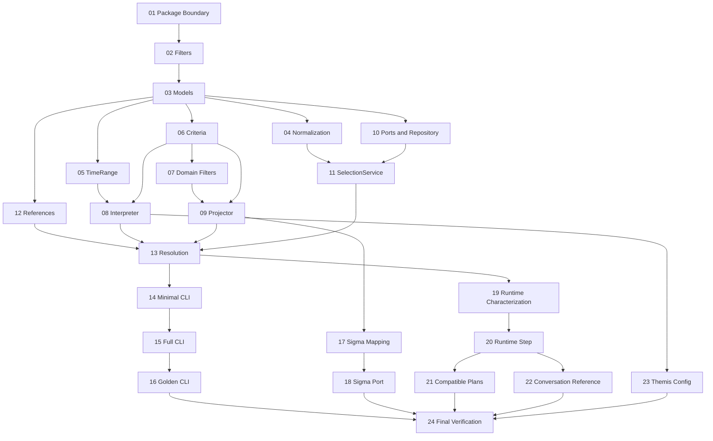

# SelectionSet 实施任务计划

## 1. 文档目的

本文档把 `docs/selection-set-design.md` 中的目标设计拆成可独立执行的小任务。
任务描述面向能力较弱的代码模型，强调确定输入、确定输出、允许修改范围和禁止行为。

执行者必须按任务编号顺序实施。除非任务明确允许，不得提前实现后续任务。

最终目标：

```text
Themis IntentDecision JSON
  -> Selection criteria / reference
  -> RecordQuery
  -> SelectionSet
  -> optional Operation binding
  -> deterministic result / compatible final plan
```

同时提供离线 CLI：

```powershell
python -m synapse.selection.cli <command> [arguments]
```

CLI 必须能够在不调用 LLM、SigMA、HTTP 或真实数据库的情况下即时输出 JSON。

本计划分为三个里程碑：

```text
M1 独立 Selection 核心：Task 01-16
M2 SigMA 查询适配：Task 17-18
M3 Runtime / Plan / Themis 集成：Task 19-24
```

完成 Task 01-16 后，已经满足“模块可独立测试并通过 CLI 即时输出结果”的要求。
后续集成不得反向污染 M1 的纯模型和离线测试。

本计划不实现完整 Confirmation 状态机。Selection 模块只负责向 Operation 绑定
`selection_id`、`content_hash` 和 `snapshot_version`。确认时的 stale 校验、
token、幂等和审计应由独立 Confirmation 任务计划实现。

---

## 2. 全局执行约束

### 2.1 开始每个任务前

执行者必须先完成以下检查：

1. 阅读 `AGENTS.md`。
2. 阅读 `docs/themis.md`。
3. 阅读 `docs/selection-set-design.md`。
4. 运行任务指定的基线测试。
5. 执行 `git status --short`，不得覆盖已有未提交改动。

### 2.2 所有任务共同禁止

- 禁止直接导入 `intent_fusion`。
- 禁止修改 `../themis`。
- 禁止新增第三方依赖。
- 禁止修改现有公开 API、Pydantic Schema 或 `/turns` 响应格式。
- 禁止修改现有意图 YAML，除非执行到明确授权的配置任务。
- 禁止把 Selection 逻辑写入 `TaskPlanBuilder`、`SynapseConductor` 或
  `SlotCommitterStep`。
- 禁止创建无限增长的 `utils.py`、`helpers.py` 或 `common.py`。
- 禁止调用真实网络、真实 SigMA 或真实 LLM 作为单元测试前提。
- 禁止捕获宽泛异常后静默返回默认值。
- 禁止在同一个任务中同时实现模型、外部适配、Runtime 接入和 API 变更。
- 禁止顺手格式化或重构无关文件。

### 2.3 Diff 限制

- 每个任务的非测试有效变更原则上不超过 220 行。
- 测试代码可以超过该限制，但应保持单个测试文件职责单一。
- 如果预计超过限制，必须拆成新的任务，不得扩大当前任务。

### 2.4 任务完成输出

每个任务完成后，执行者必须报告：

- 改动摘要
- 修改文件
- 行为影响
- 风险点
- 已运行测试及结果
- 回滚方式

### 2.5 全局测试命令

优先使用：

```powershell
uv run pytest
uv run ruff check .
uv run mypy src
```

如果全量测试因既有问题失败，必须同时运行当前任务的精确测试，并记录全量失败原因。

---

## 3. 目标目录

任务完成后预计形成以下结构：

```text
src/synapse/
  selection/
    __init__.py
    models.py
    filters.py
    normalization.py
    time_ranges.py
    query_port.py
    repository.py
    service.py
    references.py
    cli.py

  domains/
    data_management/
      __init__.py
      selection_criteria.py
      selection_interpreter.py
      selection_projector.py
      selection_filters.py

  application/
    selection_resolution.py

tests/
  selection/
    test_filters.py
    test_models.py
    test_normalization.py
    test_time_ranges.py
    test_criteria.py
    test_interpreter.py
    test_projector.py
    test_repository.py
    test_service.py
    test_references.py
    test_resolution.py
    test_cli.py
    fixtures/
```

目录是目标，不要求第一个任务一次性创建全部文件。

---

## 4. CLI 最终契约

### 4.1 设计原则

- 使用 Python 标准库 `argparse`。
- 使用 `python -m synapse.selection.cli` 调用。
- 正常结果写到 stdout。
- 错误信息写到 stderr。
- 正常退出码为 `0`。
- 输入或校验错误退出码为 `2`。
- 未预期内部错误退出码为 `1`，并保留错误类型和上下文。
- JSON 输出必须稳定，测试中可直接比较。
- 默认禁止网络访问。

### 4.2 最终命令

```powershell
python -m synapse.selection.cli parse-time-range `
  --value "relative:last_7_days" `
  --now "2026-06-10T15:30:00+08:00"
```

```powershell
python -m synapse.selection.cli project `
  --decision-file tests/selection/fixtures/delete_last_7_days.json `
  --now "2026-06-10T15:30:00+08:00"
```

```powershell
python -m synapse.selection.cli create `
  --query-file tests/selection/fixtures/query_last_7_days_ng.json `
  --materialization-file tests/selection/fixtures/materialization_125.json `
  --selection-id sel_test_001 `
  --now "2026-06-10T15:30:00+08:00"
```

```powershell
python -m synapse.selection.cli resolve `
  --decision-file tests/selection/fixtures/delete_last_7_days.json `
  --conversation-file tests/selection/fixtures/conversation_empty.json `
  --materialization-file tests/selection/fixtures/materialization_125.json `
  --selection-file tests/selection/fixtures/selections_empty.json `
  --selection-id sel_test_001 `
  --now "2026-06-10T15:30:00+08:00"
```

### 4.3 `resolve` 输出示例

```json
{
  "kind": "operation",
  "selection": {
    "selection_id": "sel_test_001",
    "record_count": 125,
    "snapshot_version": "sigma-v184",
    "content_hash": "sha256:test"
  },
  "operation": {
    "operation_type": "data_delete",
    "requires_confirmation": true
  }
}
```

该输出是 Selection 模块的离线调试结果，不是现有 `/turns` 公开响应 Schema。

---

## 5. Task 01：建立包骨架和导入边界

### 目标

创建 Selection 包和 Data Management 子包，只建立空边界，不实现业务逻辑。

### 前置条件

- 当前测试通过，或已记录既有失败。
- 不存在用户正在编辑的同名文件。

### 允许修改

```text
src/synapse/selection/__init__.py
src/synapse/domains/data_management/__init__.py
tests/selection/test_import_boundaries.py
```

### 禁止修改

- `src/synapse/runtime.py`
- `src/synapse/planning/*`
- `src/synapse/slots/*`
- `configs/*`
- `pyproject.toml`

### 实施步骤

1. 创建 `src/synapse/selection/`。
2. 创建 `src/synapse/domains/data_management/`。
3. 两个 `__init__.py` 暂时不导出未实现对象。
4. 添加导入边界测试。
5. 测试必须扫描 `src/synapse/selection`，确保不出现：
   - `intent_fusion`
   - `fastapi`
   - `synapse.api`
   - `synapse.integrations.sigma`
   - `synapse.planning`

### 验收命令

```powershell
uv run pytest tests/selection/test_import_boundaries.py -q
```

### 完成判定

- 两个包可正常 import。
- 没有运行时行为变化。
- 没有新增依赖。

### 回滚

删除本任务新增的两个空包和一个测试文件。

---

## 6. Task 02：实现通用 FilterExpression

### 目标

实现不可变、可比较的通用筛选表达式，不包含 SigMA 或业务域知识。

### 允许修改

```text
src/synapse/selection/filters.py
src/synapse/selection/__init__.py
tests/selection/test_filters.py
```

### 必须实现

```python
FilterExpression
AllOf
AnyOf
Not
FieldEquals
FieldIn
StringContains
StringEquals
TimeBetween
```

### 明确约束

- 使用 `@dataclass(frozen=True, slots=True)`。
- 集合字段使用 tuple，不使用可变 list。
- `AllOf` 和 `AnyOf` 至少包含一个 child。
- `FieldIn.values` 不能为空。
- `TimeBetween.start` 不得晚于 `end`。
- 模型不负责转换 SQL。
- 模型不依赖 Pydantic。

### 禁止实现

- `ProductTypeMatch`
- `ExcessLimitTupleMatch`
- query hash
- JSON parser
- repository
- service

### 必须测试

- 每个节点可构造。
- frozen 行为。
- 值相等行为。
- 空 children 拒绝。
- 空 `FieldIn` 拒绝。
- 反向时间范围拒绝。

### 验收命令

```powershell
uv run pytest tests/selection/test_filters.py -q
```

### 完成判定

测试完全通过，并且 `filters.py` 不导入任何 `synapse.domains` 或 integration。

---

## 7. Task 03：实现 RecordQuery 和 SelectionSet 模型

### 目标

实现 Selection 核心模型，不实现持久化和创建服务。

### 允许修改

```text
src/synapse/selection/models.py
src/synapse/selection/__init__.py
tests/selection/test_models.py
```

### 必须实现

```python
SortRule
AggregationStrategy
RecordQuery
SelectionScope
SelectionSet
```

### 字段要求

`SortRule`：

```text
field: str
direction: Literal["asc", "desc"]
```

`RecordQuery`：

```text
expression: FilterExpression
aggregate: AggregationStrategy | None
sort: tuple[SortRule, ...]
limit: int | None
```

`SelectionSet`：

```text
id: str
query: RecordQuery
scope: SelectionScope
backend_ref: str | None
record_count: int
snapshot_version: str
content_hash: str
created_at: datetime
expires_at: datetime | None
derived_from: str | None
supersedes: str | None
```

`SelectionScope` 字段固定为：

```text
workspace_session_id: str | None = None
dataset_id: str | None = None
dataset_version: int | None = None
filter_hash: str | None = None
```

### 明确约束

- 所有模型不可变。
- `limit` 必须大于零。
- `record_count` 不得为负。
- `id`、`snapshot_version`、`content_hash` 不得为空。
- `expires_at` 如存在，必须晚于 `created_at`。
- 不增加 `status` 可变字段。
- stale/expired 使用计算函数判断，不原地修改模型。
- 本任务不为 `SelectionScope` 增加额外必填或跨字段校验。

### 必须测试

- 最小合法对象。
- 非法 limit。
- 非法 record count。
- 非法 expiration。
- derived/supersedes 字段保持。

### 验收命令

```powershell
uv run pytest tests/selection/test_models.py -q
```

---

## 8. Task 04：实现稳定规范化和 Query Hash

### 目标

将 `RecordQuery` 转换为确定 JSON，并计算稳定 hash。

### 允许修改

```text
src/synapse/selection/normalization.py
tests/selection/test_normalization.py
```

### 必须实现

```python
ExpressionDecoder = Callable[
    [Mapping[str, object]],
    FilterExpression,
]

normalize_query(query: RecordQuery) -> dict[str, object]
query_json(query: RecordQuery) -> str
query_hash(query: RecordQuery) -> str
query_from_dict(
    payload: Mapping[str, object],
    *,
    expression_decoders: Mapping[str, ExpressionDecoder] | None = None,
) -> RecordQuery
selection_to_dict(selection: SelectionSet) -> dict[str, object]
selection_from_dict(
    payload: Mapping[str, object],
    *,
    expression_decoders: Mapping[str, ExpressionDecoder] | None = None,
) -> SelectionSet
```

### 规范化规则

- JSON key 按字典序。
- tuple 输出为 JSON array。
- datetime 输出 ISO 8601。
- expression 节点输出 `{"type": "<snake_case_name>", ...fields}`。
- 序列化器必须递归处理 frozen dataclass expression，不得通过 import 枚举所有
  domain node。
- 核心 decoder registry 只包含 Task 02 的通用 expression。
- domain expression 通过 `expression_decoders` 参数注入。
- unknown expression type 必须报错，不得忽略。
- `AllOf` 和 `AnyOf` 保留 child 顺序。
- 不擅自排序业务条件。
- 不包含 `SelectionSet.id`、时间戳或 materialization 信息。
- hash 使用标准库 `hashlib.sha256`。
- 返回格式为 `sha256:<hex>`。

### 固定测试

必须用 golden value 断言至少一个完整 query 的 hash。

### 禁止行为

- 不使用 `repr()` 作为持久序列化格式。
- 不使用 Python 内置 `hash()`。
- 不对语义未知的 child 自动重排。
- 不从 `selection/normalization.py` 导入 `synapse.domains`。

### 验收命令

```powershell
uv run pytest tests/selection/test_normalization.py -q
```

---

## 9. Task 05：实现 TimeRange 编解码

### 目标

把 Themis 字符串 target 严格转换为绝对时间区间。

### 允许修改

```text
src/synapse/selection/time_ranges.py
tests/selection/test_time_ranges.py
```

### 必须支持

绝对 ISO interval：

```text
2026-06-01T00:00:00+08:00/2026-06-10T23:59:59+08:00
```

相对 token：

```text
relative:today
relative:last_7_days
relative:current_month
```

### 必须实现

```python
@dataclass(frozen=True, slots=True)
class TimeRangeCriteria:
    start: datetime
    end: datetime


parse_time_range(value: str, *, now: datetime) -> TimeRangeCriteria
encode_time_range(value: TimeRangeCriteria) -> str
```

### 语义固定

- `today`：`now` 所在自然日的 `[00:00:00, 23:59:59.999999]`。
- `last_7_days`：包含当天，共七个自然日。
- `current_month`：当月第一天至 `now`。
- `now` 必须包含时区。
- 绝对输入的 start/end 必须包含时区。
- 不允许自动猜测无时区输入。
- 不支持的 relative token 必须明确报错。

### 禁止行为

- 不使用当前系统时间。
- 不调用 LLM 解析自然语言时间。
- 不使用第三方日期库。
- 不静默交换反向 start/end。

### 必须测试

- 三个 relative token。
- 一个绝对区间。
- 无时区拒绝。
- 反向区间拒绝。
- 非法 token 拒绝。
- encode/decode round trip。

### 验收命令

```powershell
uv run pytest tests/selection/test_time_ranges.py -q
```

---

## 10. Task 06：实现数据管理域筛选条件模型

### 目标

定义测试记录筛选条件，不读取 Themis decision，不生成 `RecordQuery`。

### 允许修改

```text
src/synapse/domains/data_management/selection_criteria.py
src/synapse/domains/data_management/__init__.py
tests/selection/test_criteria.py
```

### 必须实现

```python
ProductConfig
RecordSelectionCriteria
RelativeSelectionReference
```

`RecordSelectionCriteria` 字段必须与设计文档一致，包括：

```text
product_configs
serial_contains
excess_limit_sensors
excess_limit_test_names
excess_limit_indicators
time_ranges
judgement_results
manual_verdict
record_status
test_section
remark_contains
archived
keep_last_per_serial
only_repeat_serials
sort
limit
```

### 明确约束

- `time_ranges` 是 tuple，支持多个时间段。
- 复合 ProductConfig 不得拆成三个无关联列表。
- `excess_limit_sensors` / `excess_limit_test_names` / `excess_limit_indicators`
  是三个独立数组，后端负责生成笛卡尔积。
- 该文件不得 import Themis。
- 该文件不得 import SigMA adapter。

### 验收命令

```powershell
uv run pytest tests/selection/test_criteria.py -q
```

---

## 11. Task 07：实现业务域 Filter 节点

### 目标

实现只属于测试记录查询语义的 FilterExpression 节点。

### 允许修改

```text
src/synapse/domains/data_management/selection_filters.py
tests/selection/test_domain_filters.py
```

### 必须实现

```python
ProductTypeMatch
ExcessLimitTupleMatch
data_management_expression_decoders
```

### 约束

- 节点不可变。
- `ProductTypeMatch.configs` 不得为空。
- `ExcessLimitTupleMatch` 的 `sensors` / `test_names` / `indicators`
  至少一个不得为空。
- 节点只保存领域语义，不生成 SigMA 参数。
- 不将 `any/all` 后端匹配策略硬编码到通用 Selection。
- `data_management_expression_decoders()` 返回：
  - `product_type_match` decoder
  - `excess_limit_tuple_match` decoder
- decoder 只负责从规范化 JSON 恢复领域节点。

### 验收命令

```powershell
uv run pytest tests/selection/test_domain_filters.py -q
```

---

## 12. Task 08：实现 Themis Decision Interpreter

### 目标

消费 Themis 公开 API 形状，将 slot operations 和 action intents 转成独立、
可测试的领域解释结果。

### 允许修改

```text
src/synapse/domains/data_management/selection_interpreter.py
tests/selection/test_interpreter.py
tests/selection/fixtures/decision_*.json
```

### 输入约束

Interpreter 接受协议或普通对象，不得依赖 Themis 私有类型：

```python
interpret_decision(
    decision: object,
    *,
    now: datetime,
    active_selection_id: str | None,
) -> SelectionIntentResolution
```

### 必须定义的结果

```python
NewSelectionCriteria
ExistingSelectionReference
DerivedSelectionCriteria
SelectionClarificationRequired
SelectionIntentResolution
OperationIntent
```

### 必须识别的 entity_type

```text
record_time_range
record_judgement
selection_reference
```

### 必须识别的 action intent

第一阶段仅支持：

```text
task.nvh.data_management.records.delete -> data_delete
task.nvh.data_observation.indicator_trend_analysis.trend -> trend_analysis
```

未知 action intent 必须返回明确 unsupported 结果，不得猜测。

### 分流规则

- `decision.verdict == low`：不生成 criteria。
- `decision.verdict == ambiguous`：返回 clarification。
- `selection_reference=active` 且存在新增条件：返回 derived selection。
- `selection_reference=active` 且无新增条件：返回 existing reference。
- 无 reference 但有筛选条件：返回 new criteria。
- 无 reference 且无筛选条件，但存在需要 Selection 的 Operation：返回 clarification。

### TimeRange 规则

- 调用 Task 05 的 parser。
- 多个 time range 使用 replace/add 的顺序累积。
- remove 只删除完全匹配的区间。
- 非法区间必须返回 invalid field。

### 禁止行为

- 不调用 SelectionService。
- 不写 repository。
- 不构建 final plan。
- 不调用 Resolver。
- 不把 `slot_valid=true` 当成完整业务校验。

### 必须测试

- 纯 Selection。
- Selection + delete。
- Selection + trend。
- active reference。
- active reference + 新条件。
- 缺少 active selection。
- 非法 TimeRange。
- unknown entity type。
- unknown action intent。

### 验收命令

```powershell
uv run pytest tests/selection/test_interpreter.py -q
```

---

## 13. Task 09：实现 Selection Query Projector

### 目标

将 `RecordSelectionCriteria` 纯函数式转换为 `RecordQuery`。

### 允许修改

```text
src/synapse/domains/data_management/selection_projector.py
tests/selection/test_projector.py
```

### 映射规则

严格按 `docs/selection-set-design.md`：

```text
product_configs -> ProductTypeMatch
serial_contains -> StringContains(serial_no)
excess_limit_sensors / excess_limit_test_names / excess_limit_indicators -> ExcessLimitTupleMatch
time_ranges[1] -> TimeBetween
time_ranges[2+] -> AnyOf(TimeBetween, ...)
judgement_results -> FieldIn(judgement_result)
manual_verdict -> FieldEquals(manual_verdict)
record_status -> FieldEquals(record_status)
test_section -> FieldEquals(test_section)
remark_contains -> StringContains(remark)
archived -> FieldEquals(archived)
```

顶层多个条件必须使用 `AllOf`。

### 空条件规则

空 `RecordSelectionCriteria` 不能投影为“查询全部记录”。必须抛出明确的
`EmptySelectionCriteriaError`。

### 禁止行为

- 不调用外部系统。
- 不加载候选。
- 不生成 Selection ID。
- 不读取当前时间。
- 不修改传入 criteria。

### 验收命令

```powershell
uv run pytest tests/selection/test_projector.py -q
```

---

## 14. Task 10：实现 Query Port 与 Repository 协议

### 目标

定义 SelectionService 的依赖端口，并提供仅供测试和 CLI 使用的内存实现。

### 允许修改

```text
src/synapse/selection/query_port.py
src/synapse/selection/repository.py
tests/selection/test_repository.py
```

### 必须实现

```python
SelectionMaterialization
SelectionQueryPort
SelectionRepository
InMemorySelectionRepository
StaticSelectionQueryPort
```

### 行为要求

`InMemorySelectionRepository`：

- 以 `selection_id` 为 key。
- 重复保存同 ID 但内容不同时必须报错。
- `get` 不存在时返回 `None`。
- 不返回可变内部 dict。

`StaticSelectionQueryPort`：

- 构造时注入固定 `SelectionMaterialization`。
- 每次调用返回同一不可变结果。
- 记录收到的 query 和 scope，供测试断言。

### 禁止行为

- 不实现 SQLite。
- 不实现 SigMA HTTP。
- 不做自动 refresh。
- 不用模块级全局 dict。

### 验收命令

```powershell
uv run pytest tests/selection/test_repository.py -q
```

---

## 15. Task 11：实现 SelectionService 生命周期

### 目标

实现创建、读取和刷新不可变 SelectionSet。

### 允许修改

```text
src/synapse/selection/service.py
tests/selection/test_service.py
```

### 依赖必须注入

```text
SelectionQueryPort
SelectionRepository
Clock
SelectionIdGenerator
```

`Clock` 和 `SelectionIdGenerator` 协议定义在 `service.py`，签名固定为：

```python
class Clock(Protocol):
    def now(self) -> datetime: ...


class SelectionIdGenerator(Protocol):
    def new_id(self) -> str: ...
```

### 必须实现

```python
create(
    query,
    scope,
    *,
    derived_from=None,
    expires_at=None,
) -> SelectionSet
get(selection_id) -> SelectionSet
refresh(selection_id, *, expires_at=None) -> SelectionSet
is_expired(selection, *, now) -> bool
```

### 创建规则

1. 调用 query port materialize。
2. 生成新 ID。
3. 构造 SelectionSet。
4. 保存到 repository。
5. 返回 SelectionSet。

`content_hash` 使用 query port 返回的 materialized content hash，不得用
`query_hash(query)` 代替。

### refresh 规则

- 读取旧 SelectionSet。
- 使用旧 query 和 scope 重新 materialize。
- 必须生成新 ID。
- 新对象 `supersedes=old.id`。
- 新对象 `derived_from` 保留旧对象原值。
- refresh 的 `expires_at` 只使用调用参数；未提供时设置为 `None`。
- 旧对象不得修改或删除。
- 旧对象仍可 `get`。

### 错误规则

- ID 不存在：`SelectionNotFoundError`。
- 已过期：`SelectionExpiredError`，除非调用的是显式 refresh。
- query port 失败：保留原异常上下文，不保存半成品。

### 必须测试

- create。
- get。
- not found。
- expired。
- refresh 创建新 ID。
- refresh 保留旧 ID。
- materialize 失败时 repository 不变。

### 验收命令

```powershell
uv run pytest tests/selection/test_service.py -q
```

---

## 16. Task 12：实现 Selection 引用解析

### 目标

根据 Conversation 的引用信息解析 active/recent Selection，不管理完整会话。

### 允许修改

```text
src/synapse/selection/references.py
tests/selection/test_references.py
```

### 输入模型

```python
SelectionReferenceContext(
    active_selection_id: str | None,
    recent_selection_ids: tuple[str, ...],
)
```

### 必须支持

```text
active
previous
id:<selection_id>
```

### 规则

- `active` 返回 active ID。
- `previous` 返回 recent 中第一个不同于 active 的 ID。
- `id:*` 只提取 ID，不验证存在性。
- 无法解析返回明确 clarification result。
- 不自动回退到任意最新 ID。
- 不访问 ConversationRepository。

### 验收命令

```powershell
uv run pytest tests/selection/test_references.py -q
```

---

## 17. Task 13：实现应用层 Selection Resolution

### 目标

编排 Interpreter、Projector、SelectionService 和引用解析，输出内部结果。

### 允许修改

```text
src/synapse/application/__init__.py
src/synapse/application/selection_resolution.py
tests/selection/test_resolution.py
```

如果 `src/synapse/application/` 尚不存在，本任务允许创建。

### 必须输出

```python
SelectionOnlyResult
SelectionOperationResult
SelectionClarifyResult
SelectionUnsupportedResult
```

`SelectionOperationResult` 至少包含：

```text
selection: SelectionSet
operation_type: str
requires_confirmation: bool
selection_hash: str
snapshot_version: str
```

第一阶段风险映射固定为：

```text
trend_analysis -> requires_confirmation=False
data_delete -> requires_confirmation=True
```

### 编排顺序

1. 检查 verdict。
2. Interpreter 生成 resolution。
3. clarification 直接返回。
4. existing reference 调用 `SelectionService.get`。
5. new criteria 调用 projector 和 `SelectionService.create`。
6. derived criteria 合并旧 query 与新 query，创建新 SelectionSet。
7. 绑定 Operation。

`SelectionNotFoundError` 和 `SelectionExpiredError` 必须转换为
`SelectionClarifyResult`，不得回退到 active 或最新 Selection。

如果存在多个受支持的 `action_intents`，第一阶段返回
`SelectionUnsupportedResult(reason="multiple_operations")`，不得只取第一项。

### Derived 规则

- 不修改旧 query。
- 新 query 使用 `AllOf(old.expression, new.expression)`。
- aggregate：新 query 非 `None` 时使用新值，否则沿用旧值。
- sort：新 query 非空时使用新值，否则沿用旧值。
- limit：新 query 非 `None` 时使用新值，否则沿用旧值。
- scope 沿用旧 SelectionSet 的 scope。
- 新 SelectionSet 设置 `derived_from=old.id`。
- 旧 SelectionSet 保持可读取。

### 禁止行为

- 不构建 Pydantic Plan。
- 不修改 session。
- 不写 Conductor artifact。
- 不接 Runtime。

### 验收命令

```powershell
uv run pytest tests/selection/test_resolution.py -q
```

---

## 18. Task 14：实现最小 Selection CLI

### 目标

提供可单独执行的离线 CLI，先实现 TimeRange 和 Projector 调试。

### 允许修改

```text
src/synapse/selection/cli.py
tests/selection/test_cli.py
tests/selection/fixtures/*
```

### 本任务命令

```text
parse-time-range
project
```

### `parse-time-range`

输入：

```text
--value <string>
--now <ISO datetime with timezone>
```

输出：

```json
{
  "start": "2026-06-04T00:00:00+08:00",
  "end": "2026-06-10T23:59:59.999999+08:00"
}
```

### `project`

输入：

```text
--decision-file <path>
--now <ISO datetime with timezone>
--active-selection-id <optional>
```

输出只能是以下 kind 之一：

```text
new_selection
existing_selection
derived_selection
clarification
unsupported
```

`new_selection` 输出必须包含规范化后的 `query` 和 `query_hash`。

### JSON 输入规则

- decision file 使用 `decision.to_dict()` 的 JSON 形状。
- 不实例化真实 `BusinessIntentRecognizer`。
- 不允许 CLI 自己猜测 intent。

### 错误输出

stderr：

```json
{
  "error": "invalid_time_range",
  "message": "...",
  "field": "record_time_range"
}
```

### 禁止行为

- 不增加 `[project.scripts]`。
- 不调用网络。
- 不读取项目配置。
- 不使用全局 repository。

### 验收命令

```powershell
uv run pytest tests/selection/test_cli.py -q
uv run python -m synapse.selection.cli parse-time-range --value "relative:last_7_days" --now "2026-06-10T15:30:00+08:00"
uv run python -m synapse.selection.cli project --decision-file tests/selection/fixtures/delete_last_7_days.json --now "2026-06-10T15:30:00+08:00"
```

---

## 19. Task 15：扩展 CLI 为完整离线闭环

### 目标

增加 `create` 和 `resolve` 命令，使用固定 materialization、ID 和时钟。

### 允许修改

```text
src/synapse/selection/cli.py
tests/selection/test_cli.py
tests/selection/fixtures/*
```

### `create` 命令

输入：

```text
--query-file
--materialization-file
--selection-id
--now
--expires-at <optional>
```

输出完整 SelectionSet JSON。

`query-file` 必须通过 Task 04 的 `query_from_dict` 读取，并注入 Task 07 的
domain expression decoders。不得在 CLI 中复制一套 query parser。

### `resolve` 命令

输入：

```text
--decision-file
--conversation-file
--materialization-file
--selection-file
--selection-id
--now
```

输出 kind：

```text
selection
operation
clarification
unsupported
```

### conversation fixture

```json
{
  "active_selection_id": null,
  "recent_selection_ids": []
}
```

### materialization fixture

```json
{
  "backend_ref": "sigma:test:125",
  "record_count": 125,
  "snapshot_version": "sigma-v184",
  "content_hash": "sha256:test"
}
```

### selection repository fixture

`--selection-file` 用于预置内存仓储，格式固定为 JSON array：

```json
[]
```

引用已有 Selection 的 fixture 必须包含完整的 `SelectionSet` JSON。其 `query`
和 `scope` 必须符合 Task 03/04 的格式，不允许用空对象占位。

SelectionSet 必须通过 Task 04 的 `selection_from_dict` 读取。

### 确定性要求

相同输入必须逐字节输出相同 JSON，包括：

- selection ID
- created_at
- query hash
- record count
- operation type

### 验收命令

```powershell
uv run pytest tests/selection/test_cli.py -q
uv run python -m synapse.selection.cli resolve --decision-file tests/selection/fixtures/delete_last_7_days.json --conversation-file tests/selection/fixtures/conversation_empty.json --materialization-file tests/selection/fixtures/materialization_125.json --selection-file tests/selection/fixtures/selections_empty.json --selection-id sel_test_001 --now "2026-06-10T15:30:00+08:00"
```

---

## 20. Task 16：补充 Golden CLI 场景

### 目标

用固定 fixtures 覆盖 Selection 模块主要行为，防止后续自由修改输出。

### 允许修改

```text
tests/selection/fixtures/*
tests/selection/test_cli_golden.py
```

### 必须包含的场景

```text
select_last_7_days_ng
delete_last_7_days_ng
trend_last_100_records
delete_active_selection
derive_active_with_time_range
missing_selection_for_delete
invalid_time_range
multiple_time_ranges
unknown_action_intent
expired_selection_reference
```

每个场景至少包含：

```text
decision.json
conversation.json
materialization.json
selections.json
expected.json
```

`selections.json` 仅在 active、derived、expired 等需要预置仓储的场景必需。
其他不需要的文件可以省略，但测试必须明确说明原因。

### Golden 更新规则

- 测试不得自动覆盖 expected 文件。
- 输出变化必须人工更新 expected。
- expected 变化必须在任务报告中解释。

### 验收命令

```powershell
uv run pytest tests/selection/test_cli_golden.py -q
```

---

## 21. Task 17：增加 SigMA Query Adapter

### 目标

将 `RecordQuery` 翻译为 SigMA 查询参数。该任务不接真实网络。

### 前置门禁

必须先确认实际 SigMA 测试记录查询 API 的参数契约。不得根据猜测实现。

### 允许修改

```text
src/synapse/integrations/sigma/selection_query.py
tests/selection/test_sigma_selection_query.py
```

### 必须映射

按设计文档已有字段表：

```text
ProductTypeMatch
ExcessLimitTupleMatch
TimeBetween
StringContains
StringEquals
FieldIn
FieldEquals
AggregationStrategy
SortRule
limit
```

### 必须返回

结构化请求对象或 dict，不直接执行 HTTP。

### 禁止行为

- 不修改现有 `SigmaGateway` 公共行为。
- 不发送请求。
- 不吞掉不支持的 FilterExpression。
- 不把 unknown expression 忽略。

### 验收命令

```powershell
uv run pytest tests/selection/test_sigma_selection_query.py -q
```

---

## 22. Task 18：接入真实 Selection Query Port

### 目标

在确认 API 契约后实现查询端口，但仍不接 Runtime。

### 前置门禁

- Task 17 已完成。
- 已有可注入 HTTP client 或现有 gateway 方法可复用。
- 用户明确批准外部查询接入。

### 允许修改

```text
src/synapse/integrations/sigma/selection_query.py
src/synapse/integrations/sigma/__init__.py
tests/selection/test_sigma_selection_port.py
```

### 必须测试

- 正常 materialization。
- 空结果。
- 外部 4xx/5xx。
- 非法响应。
- snapshot/version 缺失。
- 错误保留 endpoint 和 operation 上下文。

### 禁止行为

- 不添加 fallback 到空 Selection。
- 不在 adapter 中创建 Selection ID。
- 不写 repository。

---

## 23. Task 19：增加 Runtime Characterization Tests

### 目标

在修改 Runtime 前记录当前 pipeline 行为。

### 允许修改

```text
tests/test_synapse_selection_runtime_characterization.py
```

### 禁止修改

```text
src/*
configs/*
```

### 必须记录

- 当前 step 顺序。
- slot commit 在 planning 前完成。
- 无 Selection 意图时当前 plan 不变。
- 当前 runtime 不产生 `selection` artifact。
- 当前 delete dataset 意图行为。

### 验收命令

```powershell
uv run pytest tests/test_synapse_selection_runtime_characterization.py -q
```

---

## 24. Task 20：增加 SelectionResolutionStep 适配器

### 目标

把应用层 Selection Resolution 结果写入 Conductor artifact，不修改公开 plan。

### 前置门禁

- Task 19 characterization tests 已提交。
- 用户明确批准 Runtime 接入。

### 允许修改

```text
src/synapse/application/selection_resolution.py
src/synapse/runtime.py
tests/test_synapse_selection_runtime.py
```

### Artifact 名称

固定使用：

```text
selection_resolution
active_selection
pending_selection_operation
```

### Step 插入位置

```text
SlotCommitterStep
  -> SelectionResolutionStep
  -> PlanningStep
```

### 跳过规则

- decision 与 Selection 无关时必须 no-op。
- no-op 不增加空 artifact。
- no-op 不改变现有 plan。

### 禁止行为

- 不修改 `TaskPlanBuilder`。
- 不修改 Plan Schema。
- 不修改 API response。
- 不在 Runtime 中写 domain 映射表。

### 验收命令

```powershell
uv run pytest tests/test_synapse_selection_runtime_characterization.py tests/test_synapse_selection_runtime.py -q
```

---

## 25. Task 21：增加当前 Plan Schema 兼容 Presenter

### 目标

把内部 Selection Resolution 转成当前可用的 `ReplyPlan`、`TaskPlan`、
`ConfirmPlan` 或 `ClarifyPlan`。

### 前置门禁

- 用户明确批准修改应用层执行计划构建逻辑。
- 不修改 Pydantic 字段。

### 允许修改

```text
src/synapse/application/selection_plans.py
src/synapse/runtime.py
tests/selection/test_compatible_plans.py
```

### 固定映射

```text
SelectionOnlyResult -> ReplyPlan.data["selection"]
trend_analysis -> TaskPlan.params["selection_id"]
data_delete -> ConfirmPlan.payload
clarification -> ClarifyPlan
```

### Clarify 限制

- 使用当前支持的 reason。
- missing slot 必须有非空 prompt candidates。
- pending operation 保存在内部 artifact，不增加公开字段。

### 禁止行为

- 不新增 `SelectionPlan`。
- 不新增 `ConfirmationPlan`。
- 不修改 `src/synapse/planning/plans.py`。
- 不把 Selection 业务逻辑写入 presenter。

### 验收命令

```powershell
uv run pytest tests/selection/test_compatible_plans.py tests/test_synapse_turns_api.py -q
```

---

## 26. Task 22：增加 Conversation Selection 引用状态

### 目标

跨 turn 保存 active/recent selection ID。

### 前置门禁

- 用户批准会话状态扩展。
- 已有 characterization tests。

### 推荐实现

优先新增独立 store，不直接扩展现有公开 Schema：

```text
src/synapse/session/selection_context.py
```

### 必须支持

```text
load(session_id)
set_active(session_id, selection_id)
recent(session_id)
```

### 规则

- active 变化时旧 active 进入 recent。
- recent 去重。
- recent 有固定上限，建议 10。
- 只保存 ID，不复制 SelectionSet。
- session clear 的行为必须通过测试明确，不得猜测。

### 验收命令

```powershell
uv run pytest tests/selection/test_selection_context.py tests/test_synapse_selection_multiturn.py -q
```

---

## 27. Task 23：Themis 配置扩展

### 目标

增加 Selection slot 和 records Operation 意图，使真实 Themis 能输出设计所需的
`slot_operations` 与 `action_intents`。

### 高风险门禁

该任务会修改意图 YAML 和 Prompt Examples。执行前必须获得用户明确批准。

### 允许修改

```text
configs/slots/nvh.yaml
configs/themis/intents/nvh_record_selection.yaml
configs/themis/intents/nvh_data_management.yaml
configs/themis/tree_prompt_examples.yaml
configs/themis/calibration_cases.yaml
tests/test_themis_selection_calibration.py
```

### 必须增加的 entity type

```text
record_time_range
record_judgement
selection_reference
```

### 必须增加的 intent

```text
task.nvh.record_selection.filter.time_range
task.nvh.record_selection.filter.judgement
task.nvh.record_selection.reference.active
task.nvh.data_management.records.delete
```

### 必须记录的预期差异

修改前：

```text
“删除最近一周不合格记录”无法稳定输出 Selection slots。
```

修改后：

```text
time range 和 judgement 进入 slot_operations；
records.delete 进入 action_intents。
```

### 必须测试

- 查询最近一周不合格记录。
- 删除最近一周不合格记录。
- 删除上面这些数据。
- 查询两个离散时间段。
- 删除数据集仍保持原 intent。
- “remove” 不能出现在 records.delete 的 slot action。

### 验收命令

```powershell
uv run pytest tests/test_themis_selection_calibration.py tests/test_themis_calibration_cases.py -q
```

---

## 28. Task 24：全链路离线验收

### 目标

验证模块可独立使用，并确认未破坏现有行为。

### 允许修改

```text
tests/selection/test_selection_end_to_end.py
docs/selection-set-task-plans.md
```

只允许补测试和更新完成状态，不允许在本任务修业务代码。发现问题应回到对应任务修复。

### 必须覆盖

1. decision JSON 生成纯 Selection。
2. decision JSON 生成 Selection + trend。
3. decision JSON 生成 Selection + delete。
4. active reference。
5. derived selection。
6. multiple time ranges。
7. invalid time range。
8. refresh 创建新 ID 且旧 ID 可读取。
9. CLI 输出与 Python API 输出一致。

### 必须运行

```powershell
uv run pytest tests/selection -q
uv run pytest
uv run ruff check .
uv run mypy src
```

### CLI Smoke Tests

```powershell
uv run python -m synapse.selection.cli parse-time-range --value "relative:last_7_days" --now "2026-06-10T15:30:00+08:00"
```

```powershell
uv run python -m synapse.selection.cli project --decision-file tests/selection/fixtures/delete_last_7_days.json --now "2026-06-10T15:30:00+08:00"
```

```powershell
uv run python -m synapse.selection.cli resolve --decision-file tests/selection/fixtures/delete_last_7_days.json --conversation-file tests/selection/fixtures/conversation_empty.json --materialization-file tests/selection/fixtures/materialization_125.json --selection-file tests/selection/fixtures/selections_empty.json --selection-id sel_test_001 --now "2026-06-10T15:30:00+08:00"
```

### 完成判定

- 所有 Selection 单元测试通过。
- CLI 三个 smoke command 返回退出码 0。
- CLI 不访问网络。
- 相同输入返回相同 JSON。
- 现有测试无新增失败。
- 没有直接导入 `intent_fusion`。
- 没有修改公开 API Schema。

---

## 29. 弱模型执行模板

每次只把一个 Task 交给执行模型，并附上下面的固定指令：

```text
只执行 docs/selection-set-task-plans.md 中的 Task XX。

开始前：
1. 阅读 AGENTS.md、docs/themis.md、docs/selection-set-design.md。
2. 阅读 Task XX 的目标、允许修改、禁止修改和验收命令。
3. 检查 git status，不覆盖用户已有改动。

执行约束：
1. 只修改 Task XX 允许修改的文件。
2. 不实现后续 Task。
3. 不新增依赖。
4. 不修改公开 API、Pydantic Schema、YAML 或 Runtime，除非 Task XX 明确允许。
5. 业务代码禁止导入 intent_fusion。
6. 手工编辑必须使用 apply_patch。
7. 如果任务描述与仓库实际冲突，停止修改并报告冲突，不自行发明替代架构。

完成后：
1. 运行 Task XX 的全部验收命令。
2. 报告改动摘要、修改文件、行为影响、风险点、测试结果和回滚方式。
3. 不提交 Git commit，除非另有明确指令。
```

---

## 30. 任务依赖总览



推荐实施批次：

```text
PR 1: Task 01-05
PR 2: Task 06-09
PR 3: Task 10-13
PR 4: Task 14-16
PR 5: Task 17-18
PR 6: Task 19-22
PR 7: Task 23
PR 8: Task 24
```

每个 PR 仍应逐 Task 提交，避免把多个职责压成一个不可审查的 commit。
