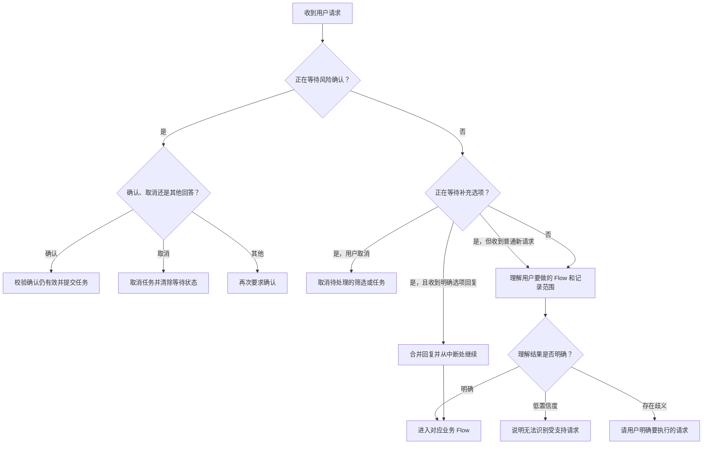
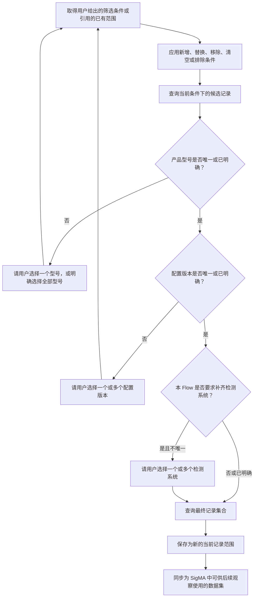
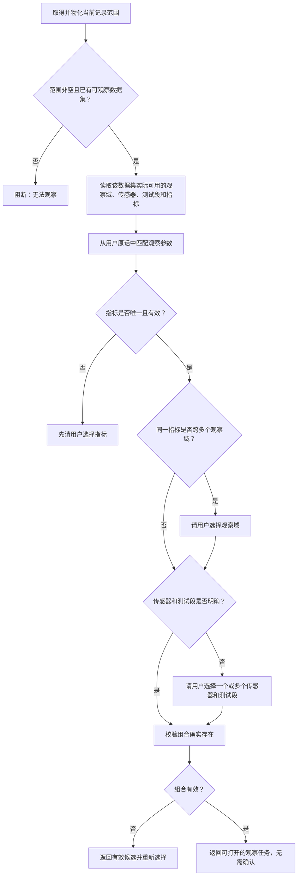
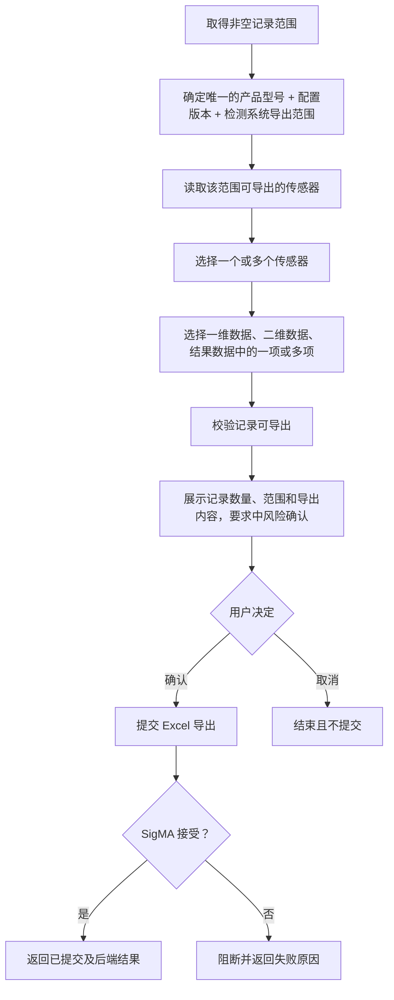
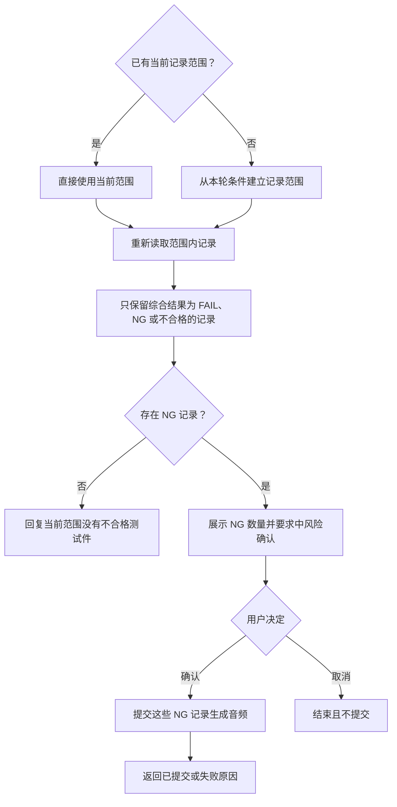

# SigMA 当前 Workflow 说明（给 Codex）

> 快照日期：2026-07-17。本文以当前代码和测试为准，只描述业务流程与可见行为，不描述数据结构、意图配置、类、接口地址或内部实现。目标是在另一套系统中复刻现有行为，而不是复刻现有架构。

## 1. 能力边界

| Flow | 当前状态 | 是否确认 | 成功终态 |
| --- | --- | --- | --- |
| 试验记录检索与多轮筛选 | 可执行 | 否 | 返回当前记录范围及数量 |
| 指标结果观察 | 可执行 | 否 | 形成可供前端打开的观察任务 |
| Excel 导出 | 可执行 | 是，中风险 | 已提交 |
| 原始数据导出 | 可执行 | 是，中风险 | 已提交 |
| NG 音频生成 | 可执行 | 是，中风险 | 已提交 |
| 试验数据备份 | 可执行 | 是，中风险 | 已提交 |
| 试验数据删除 | 可执行 | 是，高风险 | 已提交 |
| 先备份后删除 | 可执行 | 是，高风险 | 已提交 |
| 指标趋势分析 | 仅能识别，没有执行 Flow | — | 返回不支持 |
| 报告下载、报告生成 | 仅能识别，没有执行 Flow | — | 返回不支持 |
| 声彩图重算 | 仅能识别，没有执行 Flow | — | 返回不支持 |

## 2. 对话总流程

补充规则：

- 补充问题的可靠续跑方式是明确的选项回复；普通文本不是通用的待补字段答案，会按新的自然语言请求处理。
- 等待补充时可以说“取消 / 不用 / 不要 / cancel / no / n”取消。
- 等待风险确认时，明确确认才执行，明确取消则终止，其他回答只会再次显示确认。
- 一旦处于确认阶段，本轮不再理解新的业务请求；必须先确认或取消。

## 3. 所有 Flow 共用的“当前记录范围”

记录范围是后续观察、导出、音频和数据管理的共同前置结果。

当前可用于缩小记录范围的业务条件包括：

- 时间：今天、昨天、自然周/月/季度/年、最近 N 天/周/月/小时、起止日期、单边日期、从某时至今、半年等；时间无法可靠理解时必须澄清。
- 产品与记录身份：产品型号、配置版本、检测系统、精确序列号。
- 结果与标记：综合结果、人工标记总状态、测试段状态。
- 测试内容：传感器、测试段/工况、指标。
- 文本条件：备注、标记测试段。
- 数据状态：归档状态、重复序列号，以及原始数据、结果数据、报告、彩图等指定制品是否存在。
- 数量：最近 N 条，按测试时间从新到旧取数。
- 组合：同维度任一、同维度全部、排除；不同维度默认同时满足。

范围继承规则：

- 新的“查询记录”通常开启新范围，但会保留上一次唯一的产品型号作为上下文。
- 后续业务动作没有新筛选条件时，复用当前记录范围。
- 后续业务动作带新筛选条件时，按新查询处理，并最多继承唯一产品型号；NG 音频的现有例外见第 8 节。
- 明确引用“当前这些记录”或某个最近范围时，从被引用范围继续细化。
- 用户改变时间、结果、传感器等记录范围后，旧的配置版本和检测系统会失效并重新补齐；产品型号默认保留。
- 明确说“全部产品/型号不限”时，不再强制补齐产品型号、配置版本和检测系统。

## 4. Flow A：试验记录检索

1. 解析并补齐当前记录范围。
2. 查询 SigMA 记录。
3. 将结果设为会话的当前记录范围，并同步后续任务使用的数据集。
4. 返回命中数量和当前范围；即使命中 0 条，也以检索完成结束，不进入风险确认。
5. 后续可继续筛选，也可直接转入观察、导出、音频或数据管理。

## 5. Flow B：指标结果观察

支持的观察域：一维指标、时间域、频谱、阶次谱、阶次切片、倒谱、心理声学。

注意：当前后端 Flow 只准备观察所需范围和参数，不负责在对话中读取、计算或绘制最终曲线。指标趋势是另一项“仅识别、未执行”的能力，不应与本 Flow 混为一谈。

## 6. Flow C：Excel 导出

若记录横跨多个产品/版本/系统，必须先选一个导出范围；单次导出不能跨范围。当前顺序会先补齐配置版本和检测系统，再解析最终导出范围；即使原话已出现某个系统，只要前置配置版本仍有多个候选，仍会先追问配置版本。传感器为空、传感器无效或数据类型未选时，按顺序追问。

## 7. Flow D：原始数据导出

1. 取得非空记录范围。
2. 选择导出格式：H5 或 TDMS；未指定时追问。
3. 若记录涉及多个检测系统，选择一个系统；只导出该系统下的记录。
4. 展示范围和记录数量，要求中风险确认。
5. 确认后，先把试验结果记录转换为对应的原始数据条目；没有有效原始数据条目则失败。
6. 将原始数据导出到 SigMA 服务端约定的导出区域。
7. 成功返回“已提交”；转换或导出失败则返回阻断原因。取消不会提交。

## 8. Flow E：NG 音频生成

当前特殊行为：只要已有当前记录范围，本轮音频请求会直接使用它，不再应用本轮新写的筛选条件。复刻现状时应保留；若要修正，需作为行为变更单独决策。

## 9. Flow F：备份、删除、先备份后删除

1. 取得非空记录范围。
2. 根据用户动作选择“备份”“删除”或组合成“先备份后删除”。
3. 选择要处理的制品：彩图、原始数据、结果数据，可多选。
4. 备份及“先备份后删除”必须提供合法文件名；纯删除不需要文件名。
5. 备份写入 SigMA 服务端约定的备份区域。
6. 展示记录数量、动作和制品范围并确认：纯备份为中风险；包含删除为高风险。
7. 确认后一次提交；组合动作的语义是先备份成功，再删除。取消则不做任何操作。
8. 后端拒绝、记录无效或参数非法时返回阻断原因，不静默降级。

## 10. 通用终态与失败规则

- `澄清`：请求含义不明确、范围字段缺失/无效、任务参数缺失/无效；保存进度，明确回复后续跑。
- `待确认`：所有中高风险动作在提交前停住；确认与当时的记录快照绑定且有时效。
- `已就绪`：记录检索和指标观察已准备完成，不代表发生导出或写操作。
- `已提交`：SigMA 已接受导出、音频或数据管理请求；当前没有轮询进度的后续 Flow。
- `已阻断`：空记录、记录范围丢失、观察数据集缺失、候选目录失败、记录标识无效或 SigMA 调用失败。
- `已取消`：清除当前等待中的筛选、任务或确认；已激活的记录范围仍可用于之后的请求。
- 会话和当前范围只存在于当前服务进程；重启后不能继续之前的 Flow。同一会话不应并发推进两个请求。

## 11. 给重实现 Codex 的验收清单

- 只把第 1 节标记为“可执行”的能力接成成功闭环。
- 所有后续动作都先得到稳定的当前记录范围，并遵守范围继承规则。
- 补充问题必须可暂停、恢复和取消，且从原中断点继续。
- 中高风险动作必须先预览再确认；取消、过期和范围变化都不得误执行。
- Excel、原始数据、音频和数据管理必须区分“已就绪”与“已提交”。
- 指标观察只使用 SigMA 实际返回的可用候选，不凭空构造观察参数。
- 保留第 10 节的所有失败终态，不能用默认值或静默 fallback 掩盖错误。
- 为每个 Mermaid 分支至少准备一条成功、一条澄清、一条取消/阻断的验收用例。
